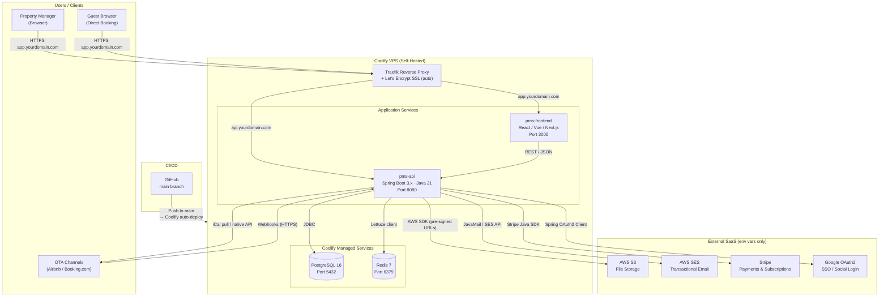

# Holiday Rental Management Platform — Architecture Document

**Version:** 1.0
**Date:** March 2026
**Status:** Draft for Review
**Base Package:** `com.rental.pms`
**Build Tool:** Maven
**Java Version:** 21 LTS

---

## Table of Contents

1. [Overview & Tech Stack](#1-overview--tech-stack)
2. [Architecture Style & Package Layout](#2-architecture-style--package-layout)
3. [Multi-Tenancy Strategy](#3-multi-tenancy-strategy)
4. [Authentication & Authorization](#4-authentication--authorization)
4.5. [Module 0 — Tenant Management](#45-module-0--tenant-management) *(NEW)*
5. [Module 1 — User Management & Roles](#5-module-1--user-management--roles)
6. [Module 2 — Property Management](#6-module-2--property-management)
7. [Module 3 — Booking & Reservation Management](#7-module-3--booking--reservation-management)
8. [Module 4 — Guest Management](#8-module-4--guest-management)
9. [Module 5 — Channel Management (OTA Sync)](#9-module-5--channel-management-ota-sync)
10. [Module 6 — Payments & Financial Management](#10-module-6--payments--financial-management)
11. [Module 7 — Subscription & Billing](#11-module-7--subscription--billing)
12. [Module 8 — Housekeeping & Cleaning Management](#12-module-8--housekeeping--cleaning-management)
13. [Module 9 — Maintenance & Issue Tracking](#13-module-9--maintenance--issue-tracking)
14. [Module 10 — Reporting & Analytics](#14-module-10--reporting--analytics)
15. [Module 11 — Owner Portal](#15-module-11--owner-portal)
16. [Module 12 — Direct Booking Website](#16-module-12--direct-booking-website)
17. [Module 13 — Search, Filtering & Navigation](#17-module-13--search-filtering--navigation)
18. [Module 14 — Audit Trail & Activity Log](#18-module-14--audit-trail--activity-log)
19. [Module 15 — Data Import & Onboarding](#19-module-15--data-import--onboarding)
20. [Module 16 — Notifications & Alerts](#20-module-16--notifications--alerts)
20.5. [Cross-Cutting: Outbound Webhooks](#205-cross-cutting-outbound-webhooks) *(NEW)*
20.6. [Cross-Cutting: Event Bus Abstraction](#206-cross-cutting-event-bus-abstraction) *(NEW)*
20.7. [Cross-Cutting: Async Thread Context Propagation](#207-cross-cutting-async-thread-context-propagation) *(NEW)*
20.8. [Cross-Cutting: Field-Level Encryption](#208-cross-cutting-field-level-encryption) *(NEW)*
20.9. [Cross-Cutting: Rate Limiting](#209-cross-cutting-rate-limiting) *(NEW)*
20.10. [Cross-Cutting: Distributed Scheduler Locking (ShedLock)](#2010-cross-cutting-distributed-scheduler-locking-shedlock) *(NEW)*
21. [Cross-Cutting: Caching](#21-cross-cutting-caching)
22. [Cross-Cutting: Deployment & Infrastructure](#22-cross-cutting-deployment--infrastructure)
    - [Coolify Deployment (Self-Hosted)](#coolify-deployment-self-hosted)
23. [Cross-Cutting: Key Dependencies](#23-cross-cutting-key-dependencies)
23.5. [Cross-Cutting: Feature Flags](#235-cross-cutting-feature-flags) *(NEW)*
24. [Non-Functional Requirements Mapping](#24-non-functional-requirements-mapping)

---

## 1. Overview & Tech Stack

| Layer | Technology |
|-------|-----------|
| Language | Java 21 LTS |
| Framework | Spring Boot 3.x |
| Build | Maven (`pom.xml` with Spring Boot parent POM) |
| Database | PostgreSQL 16 |
| ORM | Hibernate 6 / Spring Data JPA |
| Migrations | Flyway |
| Cache | Redis (via Spring Data Redis) |
| Auth | JWT (RS256) + Spring Security + OAuth2 Client (Google) |
| Payments | Stripe Java SDK |
| File Storage | AWS S3 (pre-signed URLs) |
| Email | Spring Mail + AWS SES + Thymeleaf templates |
| SMS | Twilio SDK |
| PDF | OpenPDF or iText |
| iCal | ical4j |
| API Docs | springdoc-openapi (Swagger UI) |
| DTO Mapping | MapStruct |
| Rate Limiting | Bucket4j + Redis |
| Testing | JUnit 5, Mockito, Testcontainers |
| Containerisation | Docker (multi-stage Maven build) |
| CI/CD | GitHub Actions |

---

## 2. Architecture Style & Package Layout

**Style:** Modular Monolith — each bounded context is a package-level module under `modules/`. Modules communicate via injected service interfaces. No direct cross-module entity references; use IDs and DTOs instead.

```
com.rental.pms/
│
├── PmsApplication.java                         # Spring Boot entry point
│
├── config/                                      # Global configuration
│   ├── SecurityConfig.java
│   ├── WebMvcConfig.java
│   ├── AsyncConfig.java                         # Thread pool + TenantAwareTaskDecorator
│   ├── CacheConfig.java
│   ├── S3Config.java
│   ├── StripeConfig.java
│   ├── RateLimitConfig.java                     # Bucket4j rate limit configuration
│   └── OpenApiConfig.java
│
├── common/                                      # Shared kernel (no business logic)
│   ├── entity/
│   │   ├── BaseEntity.java                      # id (UUID), tenantId, createdAt, updatedAt, createdBy, updatedBy, version
│   │   └── TenantAware.java                     # Interface: getTenantId()
│   ├── dto/
│   │   ├── PageResponse.java                    # Paginated response wrapper
│   │   ├── ErrorResponse.java                   # Standard error body
│   │   └── ApiResponse.java                     # Generic success wrapper
│   ├── exception/
│   │   ├── GlobalExceptionHandler.java          # @ControllerAdvice
│   │   ├── ResourceNotFoundException.java
│   │   ├── ConflictException.java
│   │   └── TenantLimitExceededException.java
│   ├── security/
│   │   ├── TenantContext.java                   # ThreadLocal<UUID> tenant holder
│   │   ├── TenantFilter.java                    # Servlet filter: JWT → TenantContext
│   │   ├── TenantAwareTaskDecorator.java        # Propagates TenantContext + SecurityContext to @Async threads
│   │   ├── RateLimitFilter.java                 # Bucket4j per-tenant/per-IP rate limiting
│   │   ├── JwtTokenProvider.java                # Token creation & validation (RS256)
│   │   ├── JwtAuthenticationFilter.java         # OncePerRequestFilter
│   │   └── CurrentUser.java                     # Helper to get current user from SecurityContext
│   ├── multitenancy/
│   │   ├── TenantInterceptor.java               # Hibernate @PrePersist/@PreUpdate: sets/validates tenant_id
│   │   └── TenantHibernateFilter.java           # Activates Hibernate @Filter per request
│   ├── audit/
│   │   ├── AuditEvent.java                      # Spring ApplicationEvent payload
│   │   └── AuditEventPublisher.java             # Publishes AuditEvent
│   ├── event/
│   │   ├── DomainEvent.java                     # Base class for all domain events
│   │   ├── DomainEventPublisher.java            # Interface (MVP: Spring events; Phase 2: Kafka/SQS)
│   │   └── SpringDomainEventPublisher.java      # MVP implementation using ApplicationEventPublisher
│   ├── encryption/
│   │   └── EncryptedStringConverter.java        # JPA @Converter for AES-256-GCM field encryption
│   └── util/
│       ├── SlugGenerator.java
│       └── MoneyUtil.java                       # BIGINT ↔ BigDecimal conversions
│
└── modules/
    ├── user/                                    # → MVP Section 1
    ├── tenant/                                  # → Tenant/Agency management (Module 0)
    ├── property/                                # → MVP Section 2
    ├── booking/                                 # → MVP Section 3
    ├── guest/                                   # → MVP Section 4
    ├── channel/                                 # → MVP Section 5
    ├── payment/                                 # → MVP Section 6 (payments)
    ├── subscription/                            # → MVP Section 6 (subscription & billing)
    ├── housekeeping/                            # → MVP Section 7
    ├── maintenance/                             # → MVP Section 8
    ├── reporting/                               # → MVP Section 9
    ├── owner/                                   # → MVP Section 10
    ├── directbooking/                           # → MVP Section 11
    ├── search/                                  # → MVP Section 12
    ├── audit/                                   # → MVP Section 13
    ├── dataimport/                              # → MVP Section 14
    ├── notification/                            # → MVP Section 15
    └── webhook/                                 # → Outbound webhook subscriptions & dispatch
```

Each module follows this internal structure:
```
modules/{name}/
  ├── controller/       # REST controllers
  ├── service/          # Business logic interfaces + implementations
  ├── repository/       # Spring Data JPA repositories
  ├── entity/           # JPA entities
  ├── dto/              # Request/response DTOs
  └── mapper/           # MapStruct mappers
```

### Module Dependency Rules

| Module | Depends On |
|--------|-----------|
| `tenant` | none (foundation module) |
| `booking` | `property`, `guest`, `payment` |
| `channel` | `property`, `booking` |
| `payment` | `booking`, `tenant` |
| `subscription` | `tenant` |
| `housekeeping` | `booking`, `property`, `user` |
| `maintenance` | `property`, `user` |
| `reporting` | `booking`, `property`, `payment` |
| `owner` | `property`, `booking`, `payment`, `channel` |
| `directbooking` | `property`, `booking`, `payment`, `guest` |
| `search` | `property`, `booking`, `guest` |
| `notification` | all modules (leaf consumer) |
| `audit` | none (listens to Spring events) |
| `dataimport` | `property`, `booking`, `guest`, `channel` |

**No circular dependencies allowed.**

> **Circular dependency fix:** The original design had `booking` → `channel` and `channel` → `booking`, creating a cycle. This is resolved by removing the `booking` → `channel` dependency. Instead, `booking` publishes Spring events (`BookingCreatedEvent`, `BookingModifiedEvent`, `BookingCancelledEvent`, `CalendarBlockCreatedEvent`) and the `channel` module listens to these events to trigger cross-channel date blocking and rate pushes. This keeps the dependency unidirectional: `channel` → `booking` (for reading booking data), while `booking` has no knowledge of channels.

---

## 3. Multi-Tenancy Strategy

**Approach:** Shared schema with `tenant_id` discriminator column on every tenant-scoped table.

### Enforcement Layers

| Layer | Mechanism | Purpose |
|-------|-----------|---------|
| 1. Servlet Filter | `TenantFilter` extracts `tenantId` from JWT, stores in `TenantContext` (ThreadLocal) | Sets tenant for the request |
| 2. Hibernate Filter | `@FilterDef` on `BaseEntity` appends `WHERE tenant_id = :tenantId` | Automatic query scoping |
| 3. Entity Listener | `@PrePersist` sets `tenant_id`; `@PreUpdate` validates it hasn't changed | Prevents cross-tenant writes |
| 4. PostgreSQL RLS | `CREATE POLICY tenant_isolation ON <table> USING (tenant_id = current_setting('app.current_tenant')::uuid)` | Defence-in-depth at DB level |

### BaseEntity (all tenant-scoped entities extend this)

| Column | Type | Notes |
|--------|------|-------|
| `id` | `UUID` | PK, generated via `gen_random_uuid()` |
| `tenant_id` | `UUID NOT NULL` | FK → `tenants.id`, indexed |
| `created_at` | `TIMESTAMPTZ` | Auto-set |
| `updated_at` | `TIMESTAMPTZ` | Auto-set on update |
| `created_by` | `UUID` | FK → `users.id` |
| `updated_by` | `UUID` | FK → `users.id` |
| `version` | `BIGINT` | Optimistic locking (`@Version`) |

### Super Admin Bypass

Super Admin JWT contains `role: SUPER_ADMIN` and no `tenantId`. The `TenantFilter` skips Hibernate filter activation for this role, allowing cross-tenant queries.

---

## 4. Authentication & Authorization

### 4.1 JWT Authentication Flow

```
Client                          Server
  │                               │
  ├─ POST /api/v1/auth/login ───→ │  (email + password)
  │                               ├─ Validate credentials (bcrypt, strength 12)
  │                               ├─ If 2FA enabled → return { twoFactorRequired: true, sessionToken }
  │                               ├─ Else → return { accessToken, refreshToken }
  │ ←─────────────────────────────┤
  │                               │
  ├─ POST /api/v1/auth/2fa/verify │  (sessionToken + TOTP code)
  │                               ├─ Validate TOTP → return { accessToken, refreshToken }
  │ ←─────────────────────────────┤
  │                               │
  ├─ GET /api/v1/properties ─────→│  (Authorization: Bearer <accessToken>)
  │                               ├─ JwtAuthenticationFilter validates token
  │                               ├─ TenantFilter sets TenantContext from JWT claims
  │                               ├─ Hibernate filter activated
  │                               ├─ Controller → Service → Repository (tenant-scoped)
  │ ←─────────────────────────────┤
  │                               │
  ├─ POST /api/v1/auth/refresh ──→│  (refreshToken)
  │                               ├─ Validate refresh token in DB
  │                               ├─ Rotate: invalidate old, issue new pair
  │ ←─────────────────────────────┤
```

### JWT Token Structure

**Access Token** (15-minute expiry, RS256 signed):
```json
{
  "sub": "<userId UUID>",
  "tenantId": "<tenantId UUID>",
  "roles": ["AGENCY_ADMIN"],
  "permissions": ["PROPERTY_CREATE", "BOOKING_CREATE", "REPORT_VIEW"],
  "iat": 1711000000,
  "exp": 1711000900
}
```

**Refresh Token** (7-day expiry, stored in DB, rotated on each use).

### 4.2 RBAC Model

**Roles (seeded in DB):**

| Role | Scope | Key Permissions |
|------|-------|----------------|
| `SUPER_ADMIN` | Platform-wide | All permissions, cross-tenant access |
| `AGENCY_ADMIN` | Tenant | All tenant permissions, manage users/roles |
| `PROPERTY_MANAGER` | Tenant (assigned properties) | CRUD bookings, guests, tasks; view reports |
| `PROPERTY_OWNER` | Tenant (own properties only) | Read-only: properties, bookings, statements; block calendar |
| `HOUSEKEEPER` | Tenant (assigned tasks only) | View/update assigned cleaning tasks |
| `GUEST` | Own booking only | View booking details, pre-arrival info |

**Permission enforcement:**
- API layer: `@PreAuthorize("hasPermission('BOOKING_CREATE')")` on controller methods
- Custom `PermissionEvaluator` reads permissions from JWT claims
- Resource-level checks in service layer (e.g., owner can only see own properties)

### 4.3 2FA (TOTP)

- Library: `dev.samstevens.totp`
- Mandatory for `SUPER_ADMIN` and `AGENCY_ADMIN`
- Setup: generate secret → display QR code → user confirms with first TOTP code
- 10 single-use recovery codes generated on setup, stored as bcrypt hashes
- Enforced at login: if `user.twoFactorEnabled == true`, initial auth returns `twoFactorRequired` flag

### 4.4 OAuth2 Social Login (Google)

- Spring Security OAuth2 Client
- Flow: Frontend redirects to Google → callback with auth code → backend exchanges for Google token → extract email → find-or-create user → issue platform JWT
- Only for registration/login, not ongoing authorization

---

## 4.5. Module 0 — Tenant Management

The Tenant module is the foundational module that all other modules depend on for multi-tenancy. Every agency/account is represented as a tenant.

### Entities & Tables

**Table: `tenants`**

| Column | Type | Notes |
|--------|------|-------|
| `id` | `UUID PK` | Generated via `gen_random_uuid()` |
| `name` | `VARCHAR(200)` | Agency/business name |
| `slug` | `VARCHAR(100) UNIQUE` | URL-friendly identifier for portfolio pages |
| `custom_domain` | `VARCHAR(255) NULL` | e.g., `bookings.client-domain.com` |
| `timezone` | `VARCHAR(50)` | e.g., `Europe/London`, used for scheduling and reporting |
| `default_currency` | `VARCHAR(3)` | ISO 4217 (e.g., `GBP`, `EUR`, `USD`) |
| `management_fee_type` | `VARCHAR(20)` | `PERCENTAGE`, `FIXED`, `PERCENTAGE_PLUS_FIXED` |
| `management_fee_percentage` | `DECIMAL(5,2) NULL` | e.g., `15.00` for 15% |
| `management_fee_fixed` | `BIGINT NULL` | Fixed fee in minor units |
| `logo_s3_key` | `VARCHAR(500) NULL` | Agency logo |
| `contact_email` | `VARCHAR(255)` | Primary contact |
| `contact_phone` | `VARCHAR(30) NULL` | |
| `address` | `TEXT NULL` | Business address |
| `status` | `VARCHAR(20)` | `ACTIVE`, `SUSPENDED`, `CANCELLED` |
| `created_at` | `TIMESTAMPTZ` | |
| `updated_at` | `TIMESTAMPTZ` | |
| `version` | `BIGINT` | Optimistic locking |

**Index:** `(slug)`, `(custom_domain)`, `(status)`

> **Note:** The `tenants` table is NOT tenant-scoped (it does not have a `tenant_id` FK). It IS the tenant. Access is controlled by matching the JWT `tenantId` claim.

### API Endpoints

| Method | Path | Description | Auth | Permissions |
|--------|------|-------------|------|-------------|
| `GET` | `/api/v1/tenant` | Get current tenant details | Authenticated | `TENANT_VIEW` |
| `PUT` | `/api/v1/tenant` | Update tenant settings | Authenticated | `TENANT_MANAGE` |
| `POST` | `/api/v1/tenant/logo/upload-url` | Get pre-signed S3 upload URL for logo | Authenticated | `TENANT_MANAGE` |
| `GET` | `/api/v1/admin/tenants` | (Super Admin) List all tenants | Authenticated | `SUPER_ADMIN` |
| `GET` | `/api/v1/admin/tenants/{id}` | (Super Admin) Get tenant details | Authenticated | `SUPER_ADMIN` |
| `PATCH` | `/api/v1/admin/tenants/{id}/status` | (Super Admin) Suspend/activate tenant | Authenticated | `SUPER_ADMIN` |

### Services

| Service | Responsibilities |
|---------|-----------------|
| `TenantService` | CRUD tenant settings, logo management, timezone/currency configuration |
| `TenantRegistrationService` | Called during account registration: creates tenant + admin user + default subscription (Starter) in a single transaction |

### Data Flow: Account Registration

```
POST /api/v1/auth/register { email, password, firstName, lastName, agencyName }
  → AuthController.register()
    → BEGIN TRANSACTION
    → TenantRegistrationService.register(dto)
      → Create Tenant { name: agencyName, slug: generated, currency: GBP, timezone: UTC }
      → TenantRepository.save(tenant)
      → Create User { email, passwordHash, tenantId, status: ACTIVE }
      → Assign role: AGENCY_ADMIN
      → UserRepository.save(user)
      → SubscriptionService.createStarterSubscription(tenantId)
      → OnboardingWizardService.initialize(tenantId)
    → COMMIT TRANSACTION
    → JwtTokenProvider.generateAccessToken(user)
    → Return { accessToken, refreshToken }
```

### Dependencies

- None (foundation module, all other modules depend on it)

---

## 5. Module 1 — User Management & Roles

**MVP Reference:** Section 1 — User Management & Roles

### Entities & Tables

**Table: `users`**

| Column | Type | Notes |
|--------|------|-------|
| `id` | `UUID PK` | |
| `tenant_id` | `UUID FK` | → `tenants.id` |
| `email` | `VARCHAR(255) UNIQUE` | Per-tenant unique constraint: `UNIQUE(tenant_id, email)` |
| `password_hash` | `VARCHAR(255)` | bcrypt |
| `first_name` | `VARCHAR(100)` | |
| `last_name` | `VARCHAR(100)` | |
| `phone` | `VARCHAR(30)` | |
| `status` | `VARCHAR(20)` | `ACTIVE`, `INVITED`, `DISABLED` |
| `two_factor_enabled` | `BOOLEAN` | Default false |
| `two_factor_secret` | `VARCHAR(255)` | Encrypted TOTP secret |
| `last_login_at` | `TIMESTAMPTZ` | |
| `created_at` | `TIMESTAMPTZ` | |
| `updated_at` | `TIMESTAMPTZ` | |
| `version` | `BIGINT` | |

**Table: `roles`**

| Column | Type | Notes |
|--------|------|-------|
| `id` | `UUID PK` | |
| `name` | `VARCHAR(50)` | `SUPER_ADMIN`, `AGENCY_ADMIN`, etc. |
| `description` | `VARCHAR(255)` | |
| `is_system` | `BOOLEAN` | System roles cannot be deleted |

**Table: `permissions`**

| Column | Type | Notes |
|--------|------|-------|
| `id` | `UUID PK` | |
| `code` | `VARCHAR(100) UNIQUE` | e.g., `BOOKING_CREATE`, `PROPERTY_EDIT` |
| `description` | `VARCHAR(255)` | |
| `module` | `VARCHAR(50)` | Which module this permission belongs to |

**Table: `role_permissions`** (join)

| Column | Type |
|--------|------|
| `role_id` | `UUID FK` → `roles.id` |
| `permission_id` | `UUID FK` → `permissions.id` |

**Table: `user_roles`** (join)

| Column | Type |
|--------|------|
| `user_id` | `UUID FK` → `users.id` |
| `role_id` | `UUID FK` → `roles.id` |

**Table: `invitations`**

| Column | Type | Notes |
|--------|------|-------|
| `id` | `UUID PK` | |
| `tenant_id` | `UUID FK` | |
| `email` | `VARCHAR(255)` | Invitee email |
| `role_id` | `UUID FK` | Pre-assigned role |
| `token` | `VARCHAR(255)` | Unique invite token |
| `invited_by` | `UUID FK` | → `users.id` |
| `status` | `VARCHAR(20)` | `PENDING`, `ACCEPTED`, `EXPIRED` |
| `expires_at` | `TIMESTAMPTZ` | Default: 7 days from creation |
| `created_at` | `TIMESTAMPTZ` | |

**Table: `refresh_tokens`**

| Column | Type | Notes |
|--------|------|-------|
| `id` | `UUID PK` | |
| `user_id` | `UUID FK` | |
| `token_hash` | `VARCHAR(255)` | SHA-256 hash of token |
| `expires_at` | `TIMESTAMPTZ` | |
| `revoked` | `BOOLEAN` | |
| `created_at` | `TIMESTAMPTZ` | |

**Table: `recovery_codes`**

| Column | Type | Notes |
|--------|------|-------|
| `id` | `UUID PK` | |
| `user_id` | `UUID FK` | |
| `code_hash` | `VARCHAR(255)` | bcrypt hash |
| `used` | `BOOLEAN` | |

**Table: `password_reset_tokens`**

| Column | Type | Notes |
|--------|------|-------|
| `id` | `UUID PK` | |
| `user_id` | `UUID FK` | → `users.id` |
| `token_hash` | `VARCHAR(255)` | SHA-256 hash of reset token |
| `expires_at` | `TIMESTAMPTZ` | Default: 1 hour from creation |
| `used` | `BOOLEAN` | Default false |
| `created_at` | `TIMESTAMPTZ` | |

### API Endpoints

| Method | Path | Description | Auth | Permissions |
|--------|------|-------------|------|-------------|
| `POST` | `/api/v1/auth/register` | Register new account (creates tenant + admin user) | Public | — |
| `POST` | `/api/v1/auth/login` | Login with email/password | Public | — |
| `POST` | `/api/v1/auth/refresh` | Refresh access token | Public (refresh token) | — |
| `POST` | `/api/v1/auth/logout` | Invalidate refresh token | Authenticated | — |
| `POST` | `/api/v1/auth/password-reset/request` | Request password reset email | Public | — |
| `POST` | `/api/v1/auth/password-reset/confirm` | Reset password with token | Public (reset token) | — |
| `POST` | `/api/v1/auth/2fa/setup` | Initialize 2FA (returns QR code) | Authenticated | — |
| `POST` | `/api/v1/auth/2fa/verify` | Verify TOTP code during login | Public (session token) | — |
| `POST` | `/api/v1/auth/2fa/disable` | Disable 2FA | Authenticated | — |
| `GET` | `/api/v1/users` | List users in tenant | Authenticated | `USER_VIEW` |
| `GET` | `/api/v1/users/{id}` | Get user details | Authenticated | `USER_VIEW` |
| `PUT` | `/api/v1/users/{id}` | Update user profile | Authenticated | `USER_EDIT` |
| `PATCH` | `/api/v1/users/{id}/status` | Activate/disable user | Authenticated | `USER_MANAGE` |
| `PATCH` | `/api/v1/users/{id}/roles` | Assign/remove roles | Authenticated | `USER_MANAGE` |
| `DELETE` | `/api/v1/users/{id}` | Soft-disable user | Authenticated | `USER_MANAGE` |
| `POST` | `/api/v1/invitations` | Invite team member by email | Authenticated | `USER_INVITE` |
| `GET` | `/api/v1/invitations` | List pending invitations | Authenticated | `USER_INVITE` |
| `POST` | `/api/v1/invitations/{token}/accept` | Accept invitation & create account | Public (invite token) | — |
| `DELETE` | `/api/v1/invitations/{id}` | Revoke invitation | Authenticated | `USER_INVITE` |

### Services

| Service | Responsibilities |
|---------|-----------------|
| `AuthService` | Login, register, token issuance, password reset, OAuth2 callback |
| `UserService` | CRUD users, status changes, role assignment |
| `InvitationService` | Create/send/accept/revoke invitations |
| `TwoFactorService` | TOTP setup, verification, recovery codes |
| `JwtTokenProvider` | (in `common/security`) Create/validate JWT, extract claims |

### Data Flow: User Login

```
POST /api/v1/auth/login { email, password }
  → AuthController.login()
    → AuthService.authenticate(email, password)
      → UserRepository.findByEmailAndTenantId(email, tenantId)
      → BCrypt.verify(password, user.passwordHash)
      → If 2FA enabled: return TwoFactorRequiredResponse { sessionToken }
      → Else: JwtTokenProvider.generateAccessToken(user) + generateRefreshToken(user)
      → RefreshTokenRepository.save(hashedToken)
      → AuditEventPublisher.publish(LOGIN_SUCCESS, userId)
    → Return { accessToken, refreshToken }
```

### Dependencies

- None (foundation module)

---

## 6. Module 2 — Property Management

**MVP Reference:** Section 2 — Property Management

### Entities & Tables

**Table: `properties`**

| Column | Type | Notes |
|--------|------|-------|
| `id` | `UUID PK` | |
| `tenant_id` | `UUID FK` | |
| `owner_id` | `UUID FK` | → `users.id` (property owner) |
| `name` | `VARCHAR(200)` | |
| `slug` | `VARCHAR(200)` | URL-friendly, unique per tenant |
| `description` | `TEXT` | |
| `property_type` | `VARCHAR(50)` | `APARTMENT`, `VILLA`, `COTTAGE`, `HOUSE`, `STUDIO`, `OTHER` |
| `address_line1` | `VARCHAR(255)` | |
| `address_line2` | `VARCHAR(255)` | |
| `city` | `VARCHAR(100)` | |
| `state_province` | `VARCHAR(100)` | |
| `postal_code` | `VARCHAR(20)` | |
| `country` | `VARCHAR(3)` | ISO 3166-1 alpha-3 |
| `latitude` | `DECIMAL(10,7)` | |
| `longitude` | `DECIMAL(10,7)` | |
| `max_guests` | `INTEGER` | |
| `bedrooms` | `INTEGER` | |
| `bathrooms` | `INTEGER` | |
| `beds` | `INTEGER` | |
| `check_in_time` | `TIME` | |
| `check_out_time` | `TIME` | |
| `internal_notes` | `TEXT` | Staff-only |
| `default_housekeeper_id` | `UUID FK NULL` | → `users.id` (auto-assigned to cleaning tasks on checkout) |
| `status` | `VARCHAR(20)` | `ACTIVE`, `ARCHIVED` |
| `archived_at` | `TIMESTAMPTZ` | Soft delete |
| `created_at` | `TIMESTAMPTZ` | |
| `updated_at` | `TIMESTAMPTZ` | |
| `version` | `BIGINT` | |

**Index:** `(tenant_id)`, `(tenant_id, status)`, `(tenant_id, owner_id)`

**Table: `property_photos`**

| Column | Type | Notes |
|--------|------|-------|
| `id` | `UUID PK` | |
| `property_id` | `UUID FK` | |
| `tenant_id` | `UUID FK` | |
| `s3_key` | `VARCHAR(500)` | S3 object key |
| `filename` | `VARCHAR(255)` | Original filename |
| `content_type` | `VARCHAR(50)` | MIME type |
| `size_bytes` | `BIGINT` | |
| `sort_order` | `INTEGER` | Display order |
| `caption` | `VARCHAR(255)` | Optional |
| `created_at` | `TIMESTAMPTZ` | |

**Table: `amenities`** (global reference table, not tenant-scoped)

| Column | Type | Notes |
|--------|------|-------|
| `id` | `UUID PK` | |
| `name` | `VARCHAR(100)` | e.g., `Wi-Fi`, `Parking`, `Pool` |
| `category` | `VARCHAR(50)` | e.g., `CONNECTIVITY`, `OUTDOOR`, `SAFETY` |
| `icon` | `VARCHAR(50)` | Icon identifier |

**Table: `property_amenities`** (join)

| Column | Type |
|--------|------|
| `property_id` | `UUID FK` |
| `amenity_id` | `UUID FK` |

**Table: `property_custom_amenities`** (free-text additions per property)

| Column | Type |
|--------|------|
| `id` | `UUID PK` |
| `property_id` | `UUID FK` |
| `tenant_id` | `UUID FK` |
| `name` | `VARCHAR(100)` |

**Table: `property_tags`**

| Column | Type | Notes |
|--------|------|-------|
| `id` | `UUID PK` | |
| `tenant_id` | `UUID FK` | |
| `name` | `VARCHAR(50)` | e.g., `beachfront`, `luxury`, `pet-friendly` |

**Table: `property_tag_assignments`** (join)

| Column | Type |
|--------|------|
| `property_id` | `UUID FK` |
| `tag_id` | `UUID FK` |

**Table: `property_groups`**

| Column | Type | Notes |
|--------|------|-------|
| `id` | `UUID PK` | |
| `tenant_id` | `UUID FK` | |
| `name` | `VARCHAR(100)` | e.g., `London Properties`, `Owner: Smith` |
| `group_type` | `VARCHAR(30)` | `LOCATION`, `OWNER`, `CUSTOM` |

**Table: `property_group_members`** (join)

| Column | Type |
|--------|------|
| `property_id` | `UUID FK` |
| `group_id` | `UUID FK` |

### API Endpoints

| Method | Path | Description | Permissions |
|--------|------|-------------|-------------|
| `POST` | `/api/v1/properties` | Create property | `PROPERTY_CREATE` |
| `GET` | `/api/v1/properties` | List properties (filterable) | `PROPERTY_VIEW` |
| `GET` | `/api/v1/properties/{id}` | Get property details | `PROPERTY_VIEW` |
| `PUT` | `/api/v1/properties/{id}` | Update property | `PROPERTY_EDIT` |
| `PATCH` | `/api/v1/properties/{id}/archive` | Archive property | `PROPERTY_EDIT` |
| `PATCH` | `/api/v1/properties/{id}/restore` | Restore archived property | `PROPERTY_EDIT` |
| `POST` | `/api/v1/properties/{id}/photos/upload-url` | Get pre-signed S3 upload URL | `PROPERTY_EDIT` |
| `POST` | `/api/v1/properties/{id}/photos` | Confirm photo upload (create record) | `PROPERTY_EDIT` |
| `GET` | `/api/v1/properties/{id}/photos` | List property photos | `PROPERTY_VIEW` |
| `PUT` | `/api/v1/properties/{id}/photos/reorder` | Reorder photos | `PROPERTY_EDIT` |
| `DELETE` | `/api/v1/properties/{id}/photos/{photoId}` | Delete photo | `PROPERTY_EDIT` |
| `GET` | `/api/v1/amenities` | List all available amenities | `PROPERTY_VIEW` |
| `PUT` | `/api/v1/properties/{id}/amenities` | Set property amenities | `PROPERTY_EDIT` |
| `GET` | `/api/v1/properties/{id}/amenities` | Get property amenities | `PROPERTY_VIEW` |
| `POST` | `/api/v1/tags` | Create tag | `PROPERTY_EDIT` |
| `GET` | `/api/v1/tags` | List tags | `PROPERTY_VIEW` |
| `PUT` | `/api/v1/properties/{id}/tags` | Set property tags | `PROPERTY_EDIT` |
| `POST` | `/api/v1/property-groups` | Create property group | `PROPERTY_EDIT` |
| `GET` | `/api/v1/property-groups` | List property groups | `PROPERTY_VIEW` |
| `PUT` | `/api/v1/property-groups/{id}/members` | Set group members | `PROPERTY_EDIT` |
| `GET` | `/api/v1/properties/dashboard` | Multi-property dashboard summary | `PROPERTY_VIEW` |

### Services

| Service | Responsibilities |
|---------|-----------------|
| `PropertyService` | CRUD properties, archive/restore, validation (plan limits via `SubscriptionEnforcementService`) |
| `PropertyPhotoService` | Pre-signed URL generation, photo record CRUD, reorder, S3 cleanup |
| `AmenityService` | List/manage amenities, assign to properties |
| `PropertyTagService` | CRUD tags, assign to properties |
| `PropertyGroupService` | CRUD groups, manage membership |

### Data Flow: Create Property

```
POST /api/v1/properties { name, address, type, ... }
  → PropertyController.create()
    → SubscriptionEnforcementService.checkPropertyLimit(tenantId)
      → TenantRepository.getPropertyCount(tenantId) vs plan limit
      → If exceeded: throw TenantLimitExceededException
    → PropertyService.create(dto)
      → PropertyMapper.toEntity(dto)
      → Set tenantId from TenantContext
      → PropertyRepository.save(entity)
      → AuditEventPublisher.publish(PROPERTY_CREATED, propertyId)
    → Return PropertyResponse (201 Created)
```

### Data Flow: Photo Upload

```
1. POST /api/v1/properties/{id}/photos/upload-url { filename, contentType }
   → PropertyPhotoService.generateUploadUrl()
     → S3Client.presignPutObject(bucket, key, 5min expiry, 10MB max)
   → Return { uploadUrl, s3Key }

2. Client uploads file directly to S3 using pre-signed URL

3. POST /api/v1/properties/{id}/photos { s3Key, filename, contentType, sizeBytes }
   → PropertyPhotoService.confirmUpload()
     → Verify S3 object exists
     → PropertyPhotoRepository.save(record)
   → Return PropertyPhotoResponse (201 Created)
```

### Dependencies

- `subscription` module (plan limit checks)

---

## 7. Module 3 — Booking & Reservation Management

**MVP Reference:** Section 3 — Booking & Reservation Management

### Entities & Tables

**Table: `bookings`**

| Column | Type | Notes |
|--------|------|-------|
| `id` | `UUID PK` | |
| `tenant_id` | `UUID FK` | |
| `property_id` | `UUID FK` | → `properties.id` |
| `guest_id` | `UUID FK` | → `guests.id` |
| `channel_connection_id` | `UUID FK NULL` | → `channel_connections.id` (source channel) |
| `confirmation_code` | `VARCHAR(20)` | Unique, auto-generated (e.g., `BK-A3X7M9`) |
| `status` | `VARCHAR(20)` | `ENQUIRY`, `CONFIRMED`, `CHECKED_IN`, `CHECKED_OUT`, `CANCELLED` |
| `check_in_date` | `DATE` | |
| `check_out_date` | `DATE` | |
| `num_guests` | `INTEGER` | |
| `num_nights` | `INTEGER` | Computed |
| `base_nightly_rate` | `BIGINT` | In minor units (cents) |
| `total_nightly_amount` | `BIGINT` | base_rate × nights (may vary per night) |
| `cleaning_fee` | `BIGINT` | |
| `extra_guest_fee` | `BIGINT` | |
| `short_stay_surcharge` | `BIGINT` | |
| `discount_amount` | `BIGINT` | Length-of-stay / last-minute / early-bird / coupon |
| `discount_type` | `VARCHAR(30)` | `LENGTH_OF_STAY`, `LAST_MINUTE`, `EARLY_BIRD`, `COUPON` |
| `subtotal` | `BIGINT` | Before tax |
| `tax_amount` | `BIGINT` | Sum of all taxes |
| `total_amount` | `BIGINT` | Final guest-facing total |
| `currency` | `VARCHAR(3)` | ISO 4217 (e.g., `GBP`, `EUR`) |
| `coupon_id` | `UUID FK NULL` | → `coupons.id` |
| `channel_source` | `VARCHAR(30)` | `DIRECT`, `AIRBNB`, `BOOKING_COM`, `VRBO`, `OTHER` |
| `notes` | `TEXT` | Staff notes |
| `cancellation_policy` | `VARCHAR(20)` | `FLEXIBLE`, `MODERATE`, `STRICT` |
| `cancelled_at` | `TIMESTAMPTZ` | |
| `cancellation_reason` | `TEXT` | |
| `block_type` | `VARCHAR(20) NULL` | `MAINTENANCE`, `OWNER_STAY`, `HOLD` (for non-guest blocks) |
| `created_at` | `TIMESTAMPTZ` | |
| `updated_at` | `TIMESTAMPTZ` | |
| `version` | `BIGINT` | |

**Indexes:** `(tenant_id, property_id, check_in_date, check_out_date)`, `(tenant_id, status)`, `(tenant_id, confirmation_code)`, `(tenant_id, guest_id)`

**Partial index for availability checks:**
```sql
CREATE INDEX idx_bookings_availability
  ON bookings (tenant_id, property_id, check_in_date, check_out_date)
  WHERE status NOT IN ('CANCELLED');
```
> This partial index accelerates the critical availability check query by excluding cancelled bookings from the index, reducing index size and improving scan performance.

**Table: `booking_status_history`**

| Column | Type | Notes |
|--------|------|-------|
| `id` | `UUID PK` | |
| `booking_id` | `UUID FK` | |
| `from_status` | `VARCHAR(20)` | |
| `to_status` | `VARCHAR(20)` | |
| `changed_by` | `UUID FK` | → `users.id` |
| `notes` | `TEXT` | |
| `created_at` | `TIMESTAMPTZ` | |

**Table: `booking_nightly_rates`** (per-night rate breakdown for variable pricing)

| Column | Type | Notes |
|--------|------|-------|
| `id` | `UUID PK` | |
| `booking_id` | `UUID FK` | |
| `date` | `DATE` | |
| `rate` | `BIGINT` | Nightly rate for this date in minor units |
| `rate_type` | `VARCHAR(20)` | `PEAK`, `OFF_PEAK`, `SHOULDER`, `WEEKEND`, `WEEKDAY` |

**Table: `seasonal_rates`**

| Column | Type | Notes |
|--------|------|-------|
| `id` | `UUID PK` | |
| `tenant_id` | `UUID FK` | |
| `property_id` | `UUID FK NULL` | NULL = applies to property group |
| `property_group_id` | `UUID FK NULL` | |
| `name` | `VARCHAR(100)` | e.g., "Summer Peak 2026" |
| `season_type` | `VARCHAR(20)` | `PEAK`, `OFF_PEAK`, `SHOULDER` |
| `start_date` | `DATE` | |
| `end_date` | `DATE` | |
| `nightly_rate` | `BIGINT` | |
| `weekend_rate` | `BIGINT NULL` | Override for Fri/Sat; NULL = use nightly_rate |
| `min_stay_nights` | `INTEGER` | Default 1 |
| `currency` | `VARCHAR(3)` | |

**Table: `pricing_rules`**

| Column | Type | Notes |
|--------|------|-------|
| `id` | `UUID PK` | |
| `tenant_id` | `UUID FK` | |
| `property_id` | `UUID FK` | |
| `rule_type` | `VARCHAR(30)` | See below |
| `config` | `JSONB` | Rule-specific configuration |
| `enabled` | `BOOLEAN` | |
| `priority` | `INTEGER` | Evaluation order |

**`rule_type` values and `config` examples:**

| `rule_type` | `config` example |
|-------------|-----------------|
| `LENGTH_OF_STAY_DISCOUNT` | `{ "weeklyDiscountPct": 10, "monthlyDiscountPct": 20 }` |
| `EXTRA_GUEST_FEE` | `{ "baseOccupancy": 4, "feePerGuestPerNight": 2500 }` (25.00) |
| `CLEANING_FEE` | `{ "flatFee": 7500 }` (75.00) |
| `SHORT_STAY_PREMIUM` | `{ "thresholdNights": 2, "surcharge": 3000 }` (30.00) |
| `LAST_MINUTE_DISCOUNT` | `{ "withinDays": 3, "discountPct": 15 }` |
| `EARLY_BIRD_DISCOUNT` | `{ "aheadDays": 90, "discountPct": 10 }` |
| `CHANNEL_RATE_ADJUSTMENT` | `{ "channel": "DIRECT", "adjustmentPct": -10 }` |

**Table: `tax_configurations`**

| Column | Type | Notes |
|--------|------|-------|
| `id` | `UUID PK` | |
| `tenant_id` | `UUID FK` | |
| `property_id` | `UUID FK NULL` | NULL = tenant-wide default |
| `name` | `VARCHAR(100)` | e.g., "VAT", "Tourist Tax" |
| `rate_percentage` | `DECIMAL(6,4)` | e.g., `20.0000` for 20% |
| `is_per_night` | `BOOLEAN` | True for per-night taxes (tourist tax) |
| `per_night_amount` | `BIGINT NULL` | Flat per-night amount (alternative to %) |
| `per_guest` | `BOOLEAN` | True if multiplied by guest count |
| `enabled` | `BOOLEAN` | |

**Table: `booking_tax_line_items`**

| Column | Type | Notes |
|--------|------|-------|
| `id` | `UUID PK` | |
| `booking_id` | `UUID FK` | |
| `tax_config_id` | `UUID FK` | |
| `tax_name` | `VARCHAR(100)` | Snapshot at booking time |
| `rate_percentage` | `DECIMAL(6,4)` | Snapshot |
| `amount` | `BIGINT` | Calculated tax amount |

**Table: `cancellation_policies`**

| Column | Type | Notes |
|--------|------|-------|
| `id` | `UUID PK` | |
| `tenant_id` | `UUID FK` | |
| `property_id` | `UUID FK` | |
| `policy_type` | `VARCHAR(20)` | `FLEXIBLE`, `MODERATE`, `STRICT` |
| `refund_rules` | `JSONB` | `[{ "daysBeforeCheckin": 7, "refundPct": 100 }, { "daysBeforeCheckin": 0, "refundPct": 50 }]` |

**Table: `coupons`**

| Column | Type | Notes |
|--------|------|-------|
| `id` | `UUID PK` | |
| `tenant_id` | `UUID FK` | |
| `code` | `VARCHAR(50)` | Unique per tenant |
| `discount_type` | `VARCHAR(20)` | `PERCENTAGE`, `FLAT` |
| `discount_value` | `BIGINT` | Percentage (e.g., 1000 = 10.00%) or flat amount in minor units |
| `max_uses` | `INTEGER NULL` | NULL = unlimited |
| `current_uses` | `INTEGER` | |
| `valid_from` | `DATE` | |
| `valid_until` | `DATE` | |
| `applies_to_all_properties` | `BOOLEAN` | Default true. If false, check `coupon_properties` join table |
| `enabled` | `BOOLEAN` | |

**Table: `coupon_properties`** (join — restricts coupon to specific properties)

| Column | Type |
|--------|------|
| `coupon_id` | `UUID FK` → `coupons.id` |
| `property_id` | `UUID FK` → `properties.id` |

> **Note:** Replaces `applicable_property_ids UUID[]` array. A join table is preferred for indexability and foreign key integrity.

### API Endpoints

| Method | Path | Description | Permissions |
|--------|------|-------------|-------------|
| `POST` | `/api/v1/bookings` | Create booking (manual by staff) | `BOOKING_CREATE` |
| `GET` | `/api/v1/bookings` | List bookings (filterable) | `BOOKING_VIEW` |
| `GET` | `/api/v1/bookings/{id}` | Get booking details | `BOOKING_VIEW` |
| `PUT` | `/api/v1/bookings/{id}` | Modify booking (dates, guests) | `BOOKING_EDIT` |
| `PATCH` | `/api/v1/bookings/{id}/status` | Change booking status | `BOOKING_EDIT` |
| `POST` | `/api/v1/bookings/{id}/cancel` | Cancel booking (triggers refund calc) | `BOOKING_CANCEL` |
| `POST` | `/api/v1/bookings/price-preview` | Preview price breakdown | `BOOKING_CREATE` |
| `POST` | `/api/v1/bookings/blocks` | Create calendar block (maintenance/owner stay) | `BOOKING_CREATE` |
| `GET` | `/api/v1/properties/{id}/availability` | Get availability calendar | `PROPERTY_VIEW` |
| `GET` | `/api/v1/properties/{id}/availability/check` | Check specific date range | `PROPERTY_VIEW` |
| `POST` | `/api/v1/properties/{id}/seasonal-rates` | Create seasonal rate | `RATE_MANAGE` |
| `GET` | `/api/v1/properties/{id}/seasonal-rates` | List seasonal rates | `RATE_MANAGE` |
| `PUT` | `/api/v1/properties/{id}/seasonal-rates/{rateId}` | Update seasonal rate | `RATE_MANAGE` |
| `DELETE` | `/api/v1/properties/{id}/seasonal-rates/{rateId}` | Delete seasonal rate | `RATE_MANAGE` |
| `POST` | `/api/v1/properties/{id}/pricing-rules` | Create pricing rule | `RATE_MANAGE` |
| `GET` | `/api/v1/properties/{id}/pricing-rules` | List pricing rules | `RATE_MANAGE` |
| `PUT` | `/api/v1/properties/{id}/pricing-rules/{ruleId}` | Update pricing rule | `RATE_MANAGE` |
| `POST` | `/api/v1/properties/{id}/tax-configs` | Create tax configuration | `RATE_MANAGE` |
| `GET` | `/api/v1/properties/{id}/tax-configs` | List tax configs | `RATE_MANAGE` |
| `POST` | `/api/v1/coupons` | Create coupon code | `COUPON_MANAGE` |
| `GET` | `/api/v1/coupons` | List coupons | `COUPON_MANAGE` |
| `POST` | `/api/v1/coupons/validate` | Validate coupon for a booking | `BOOKING_CREATE` |
| `POST` | `/api/v1/pricing/external-push` | Webhook: receive rates from PriceLabs/Beyond/Wheelhouse | API key auth |

### Services

| Service | Responsibilities |
|---------|-----------------|
| `BookingService` | Create/modify/cancel bookings, status transitions, conflict checking |
| `PricingService` | Calculate total price: base rate × nights + fees + taxes − discounts. Applies all pricing rules in priority order. |
| `AvailabilityService` | Check date availability, detect conflicts, manage calendar blocks. Uses `pg_advisory_xact_lock` for concurrent booking prevention. |
| `CancellationService` | Calculate refund based on policy + days-before-checkin. Trigger refund via `PaymentService`. |
| `SeasonalRateService` | CRUD seasonal rates per property/group |
| `PricingRuleService` | CRUD pricing rules |
| `TaxConfigService` | CRUD tax configurations |
| `CouponService` | CRUD coupons, validation, usage tracking |
| `ExternalPricingService` | Receive rate pushes from third-party dynamic pricing tools |

### Data Flow: Price Preview

```
POST /api/v1/bookings/price-preview { propertyId, checkIn, checkOut, numGuests, couponCode? }
  → BookingController.pricePreview()
    → PricingService.calculatePrice(propertyId, checkIn, checkOut, numGuests, couponCode)
      → SeasonalRateService.getRatesForDateRange(propertyId, checkIn, checkOut)
        → For each night: determine season type, apply weekday/weekend rate
        → Returns List<NightlyRate>
      → PricingRuleService.getActiveRules(propertyId)
        → Apply in priority order:
          1. Extra guest fee (if numGuests > baseOccupancy)
          2. Cleaning fee
          3. Short-stay surcharge (if nights < threshold)
          4. Length-of-stay discount
          5. Early-bird / last-minute discount (based on lead time)
          6. Channel rate adjustment
      → CouponService.validateAndApply(couponCode, subtotal) if provided
      → TaxConfigService.calculateTaxes(propertyId, subtotal)
        → For each tax: calculate line item
      → Return PriceBreakdownResponse {
          nightlyRates: [...],
          subtotalNightly, cleaningFee, extraGuestFee, shortStaySurcharge,
          discountAmount, discountType,
          subtotalBeforeTax, taxLineItems: [...], taxTotal,
          grandTotal, currency
        }
```

### Data Flow: Create Booking with Conflict Check

```
POST /api/v1/bookings { propertyId, guestId, checkIn, checkOut, numGuests, ... }
  → BookingController.create()
    → BookingService.create(dto)
      → BEGIN TRANSACTION
      → AvailabilityService.checkAndLock(propertyId, checkIn, checkOut)
        → SELECT pg_advisory_xact_lock(hashtext(propertyId::text))
        → SELECT COUNT(*) FROM bookings WHERE property_id = ? AND status NOT IN ('CANCELLED')
            AND check_in_date < ? AND check_out_date > ?
        → If conflict found: throw ConflictException("Dates unavailable")
      → PricingService.calculatePrice(...) → full breakdown
      → BookingMapper.toEntity(dto, priceBreakdown)
      → BookingRepository.save(booking)
      → BookingStatusHistoryRepository.save(ENQUIRY → CONFIRMED)
      → BookingNightlyRateRepository.saveAll(nightlyRates)
      → BookingTaxLineItemRepository.saveAll(taxItems)
      → COMMIT TRANSACTION
      → AuditEventPublisher.publish(BOOKING_CREATED, bookingId)
      → NotificationService.send(BOOKING_CONFIRMATION, guest, booking)
      → ApplicationEventPublisher.publish(BookingCreatedEvent { bookingId, propertyId, checkIn, checkOut })
        // Channel module listens to this event and triggers cross-channel date blocking
    → Return BookingResponse (201 Created)
```

### Dependencies

- `property` (property lookup, availability)
- `guest` (guest reference)
- `payment` (refund on cancellation)

> **Note:** `booking` does NOT depend on `channel`. Instead, it publishes `BookingCreatedEvent`, `BookingModifiedEvent`, `BookingCancelledEvent`, and `CalendarBlockCreatedEvent` via Spring ApplicationEvents. The `channel` module listens to these events to trigger cross-channel date blocking and rate pushes. This avoids a circular dependency between `booking` and `channel`.

---

## 8. Module 4 — Guest Management

**MVP Reference:** Section 4 — Guest Management

### Entities & Tables

**Table: `guests`**

| Column | Type | Notes |
|--------|------|-------|
| `id` | `UUID PK` | |
| `tenant_id` | `UUID FK` | |
| `user_id` | `UUID FK NULL` | → `users.id` (if guest has a platform account) |
| `first_name` | `VARCHAR(100)` | |
| `last_name` | `VARCHAR(100)` | |
| `email` | `VARCHAR(255)` | |
| `phone` | `VARCHAR(30)` | |
| `address` | `TEXT` | |
| `nationality` | `VARCHAR(3)` | ISO 3166-1 |
| `language` | `VARCHAR(5)` | e.g., `en`, `fr` |
| `flag` | `VARCHAR(20) NULL` | `VIP`, `DO_NOT_REBOOK` |
| `internal_notes` | `TEXT` | Staff-only |
| `created_at` | `TIMESTAMPTZ` | |
| `updated_at` | `TIMESTAMPTZ` | |
| `version` | `BIGINT` | |

**Index:** `(tenant_id, email)`, `(tenant_id, last_name)`

**Table: `guest_documents`**

| Column | Type | Notes |
|--------|------|-------|
| `id` | `UUID PK` | |
| `guest_id` | `UUID FK` | |
| `tenant_id` | `UUID FK` | |
| `document_type` | `VARCHAR(30)` | `PASSPORT`, `ID_CARD`, `DRIVING_LICENCE` |
| `s3_key` | `VARCHAR(500)` | Encrypted at rest (SSE-KMS) |
| `filename` | `VARCHAR(255)` | |
| `uploaded_at` | `TIMESTAMPTZ` | |
| `expires_at` | `DATE NULL` | Document expiry |

**Table: `messages`**

| Column | Type | Notes |
|--------|------|-------|
| `id` | `UUID PK` | |
| `tenant_id` | `UUID FK` | |
| `booking_id` | `UUID FK NULL` | Linked booking |
| `guest_id` | `UUID FK` | |
| `conversation_id` | `UUID` | Groups messages in a thread |
| `channel_source` | `VARCHAR(30)` | `AIRBNB`, `BOOKING_COM`, `DIRECT`, `EMAIL` |
| `direction` | `VARCHAR(10)` | `INBOUND`, `OUTBOUND` |
| `subject` | `VARCHAR(255) NULL` | |
| `body` | `TEXT` | |
| `sent_at` | `TIMESTAMPTZ` | |
| `read_at` | `TIMESTAMPTZ NULL` | |
| `assigned_to` | `UUID FK NULL` | → `users.id` (team member) |
| `snoozed_until` | `TIMESTAMPTZ NULL` | |
| `external_message_id` | `VARCHAR(255) NULL` | ID from OTA platform |
| `created_at` | `TIMESTAMPTZ` | |

**Table: `conversation_labels`**

| Column | Type |
|--------|------|
| `id` | `UUID PK` |
| `tenant_id` | `UUID FK` |
| `conversation_id` | `UUID` |
| `label` | `VARCHAR(50)` |

### API Endpoints

| Method | Path | Description | Permissions |
|--------|------|-------------|-------------|
| `POST` | `/api/v1/guests` | Create guest profile | `GUEST_CREATE` |
| `GET` | `/api/v1/guests` | List guests (filterable) | `GUEST_VIEW` |
| `GET` | `/api/v1/guests/{id}` | Get guest details + booking history | `GUEST_VIEW` |
| `PUT` | `/api/v1/guests/{id}` | Update guest profile | `GUEST_EDIT` |
| `PATCH` | `/api/v1/guests/{id}/flag` | Set flag (VIP / do-not-rebook) | `GUEST_EDIT` |
| `POST` | `/api/v1/guests/{id}/documents/upload-url` | Get pre-signed S3 upload URL | `GUEST_EDIT` |
| `POST` | `/api/v1/guests/{id}/documents` | Confirm document upload | `GUEST_EDIT` |
| `GET` | `/api/v1/guests/{id}/documents` | List guest documents | `GUEST_VIEW` |
| `DELETE` | `/api/v1/guests/{id}/documents/{docId}` | Delete document (GDPR) | `GUEST_EDIT` |
| `DELETE` | `/api/v1/guests/{id}/gdpr` | GDPR right-to-erasure (anonymize guest data) | `GUEST_MANAGE` |
| `GET` | `/api/v1/inbox` | Unified inbox (all conversations) | `MESSAGE_VIEW` |
| `GET` | `/api/v1/inbox/conversations/{conversationId}` | Get conversation thread | `MESSAGE_VIEW` |
| `POST` | `/api/v1/inbox/conversations/{conversationId}/reply` | Reply to conversation | `MESSAGE_SEND` |
| `PATCH` | `/api/v1/inbox/conversations/{conversationId}/assign` | Assign to team member | `MESSAGE_MANAGE` |
| `PATCH` | `/api/v1/inbox/conversations/{conversationId}/snooze` | Snooze conversation | `MESSAGE_MANAGE` |
| `POST` | `/api/v1/inbox/conversations/{conversationId}/labels` | Add label | `MESSAGE_MANAGE` |
| `DELETE` | `/api/v1/inbox/conversations/{conversationId}/labels/{label}` | Remove label | `MESSAGE_MANAGE` |
| `GET` | `/api/v1/inbox/unread-count` | Get unread message count | `MESSAGE_VIEW` |

### Services

| Service | Responsibilities |
|---------|-----------------|
| `GuestService` | CRUD guest profiles, flag management, booking history aggregation |
| `GuestDocumentService` | Upload/delete ID documents, S3 pre-signed URL generation |
| `InboxService` | Unified inbox: list conversations, filter, assign, snooze, label |
| `MessageService` | Send/receive messages, sync from OTA channels, link to bookings |
| `GuestEmailAutomationService` | Trigger automated email sequences: pre-arrival (confirmation → check-in instructions → arrival guide), post-departure (thank you + review request). Uses `NotificationService` for dispatch. Scheduling based on booking dates. |

### Data Flow: Unified Inbox

```
GET /api/v1/inbox?channel=AIRBNB&assigned=me&unread=true
  → InboxController.list(filters)
    → InboxService.getConversations(filters, tenantId, currentUserId)
      → MessageRepository.findConversations(
          tenantId, channelFilter, assignedFilter, unreadFilter, pageable)
        → SELECT DISTINCT conversation_id, MAX(sent_at), COUNT(*) FILTER (WHERE read_at IS NULL)
            FROM messages WHERE tenant_id = ? ...
            GROUP BY conversation_id ORDER BY MAX(sent_at) DESC
      → For each conversation: fetch latest message, guest info, booking info
    → Return PageResponse<ConversationSummary>
```

### Data Flow: GDPR Right-to-Erasure

```
DELETE /api/v1/guests/{id}/gdpr
  → GuestController.gdprErase(guestId)
    → GuestService.gdprErase(guestId, tenantId)
      → BEGIN TRANSACTION
      → Guest guest = GuestRepository.findById(guestId)
      → Anonymize guest fields:
        → guest.firstName = "DELETED"
        → guest.lastName = "DELETED"
        → guest.email = "deleted-{uuid}@anonymized.local"
        → guest.phone = NULL
        → guest.address = NULL
        → guest.nationality = NULL
        → guest.internalNotes = NULL
      → GuestRepository.save(guest)
      → Delete all guest documents from S3:
        → GuestDocumentRepository.findByGuestId(guestId)
        → For each: S3Client.deleteObject(doc.s3Key)
        → GuestDocumentRepository.deleteByGuestId(guestId)
      → Anonymize message content:
        → MessageRepository.anonymizeByGuestId(guestId)
          → UPDATE messages SET body = '[GDPR DELETED]', subject = NULL WHERE guest_id = ?
      → COMMIT TRANSACTION
      → AuditEventPublisher.publish(GUEST_GDPR_ERASED, guestId)
    → Return 204 No Content
```

> **Note:** Booking records are retained (with anonymized guest reference) for financial compliance and audit trail requirements. The booking amount, dates, and property reference remain intact.

### Dependencies

- `booking` (link messages to bookings)
- `channel` (sync messages from OTAs)
- `notification` (automated email sequences)

---

## 9. Module 5 — Channel Management (OTA Sync)

**MVP Reference:** Section 5 — Channel Management (OTA Sync)

### Entities & Tables

**Table: `channel_connections`**

| Column | Type | Notes |
|--------|------|-------|
| `id` | `UUID PK` | |
| `tenant_id` | `UUID FK` | |
| `property_id` | `UUID FK` | |
| `channel_type` | `VARCHAR(30)` | `ICAL`, `AIRBNB_API`, `BOOKING_COM_API` |
| `channel_name` | `VARCHAR(50)` | Display name (e.g., "Airbnb - Beach Villa") |
| `ical_url` | `VARCHAR(1000) NULL` | For iCal connections |
| `ical_export_url` | `VARCHAR(1000) NULL` | Our iCal feed URL for this property |
| `oauth_access_token` | `TEXT NULL` | Encrypted (for API connections) |
| `oauth_refresh_token` | `TEXT NULL` | Encrypted |
| `oauth_token_expires_at` | `TIMESTAMPTZ NULL` | |
| `external_listing_id` | `VARCHAR(255) NULL` | Listing ID on the OTA |
| `sync_interval_minutes` | `INTEGER` | Default 15, min 5 (iCal only) |
| `status` | `VARCHAR(20)` | `ACTIVE`, `PAUSED`, `ERROR` |
| `last_sync_at` | `TIMESTAMPTZ` | |
| `next_sync_at` | `TIMESTAMPTZ` | |
| `consecutive_failures` | `INTEGER` | Reset on success |
| `last_error_message` | `TEXT NULL` | |
| `created_at` | `TIMESTAMPTZ` | |
| `updated_at` | `TIMESTAMPTZ` | |

**Table: `channel_sync_logs`**

| Column | Type | Notes |
|--------|------|-------|
| `id` | `UUID PK` | |
| `channel_connection_id` | `UUID FK` | |
| `tenant_id` | `UUID FK` | |
| `sync_type` | `VARCHAR(20)` | `ICAL_PULL`, `API_PULL`, `API_PUSH`, `RATE_PUSH` |
| `status` | `VARCHAR(20)` | `SUCCESS`, `FAILED`, `PARTIAL` |
| `events_found` | `INTEGER` | |
| `events_created` | `INTEGER` | |
| `events_updated` | `INTEGER` | |
| `events_removed` | `INTEGER` | |
| `duration_ms` | `BIGINT` | |
| `error_message` | `TEXT NULL` | |
| `created_at` | `TIMESTAMPTZ` | |

**Table: `calendar_conflicts`**

| Column | Type | Notes |
|--------|------|-------|
| `id` | `UUID PK` | |
| `tenant_id` | `UUID FK` | |
| `property_id` | `UUID FK` | |
| `existing_booking_id` | `UUID FK` | |
| `conflicting_booking_id` | `UUID FK NULL` | NULL if from iCal (no booking record yet) |
| `conflicting_channel` | `VARCHAR(30)` | |
| `conflicting_check_in` | `DATE` | |
| `conflicting_check_out` | `DATE` | |
| `conflicting_guest_name` | `VARCHAR(200) NULL` | From iCal event summary |
| `resolution` | `VARCHAR(30) NULL` | `KEEP_EXISTING`, `KEEP_INCOMING`, `RELOCATED`, `PENDING` |
| `resolved_by` | `UUID FK NULL` | |
| `resolved_at` | `TIMESTAMPTZ NULL` | |
| `created_at` | `TIMESTAMPTZ` | |

### API Endpoints

| Method | Path | Description | Permissions |
|--------|------|-------------|-------------|
| `POST` | `/api/v1/channels` | Create channel connection | `CHANNEL_MANAGE` |
| `GET` | `/api/v1/channels` | List channel connections | `CHANNEL_VIEW` |
| `GET` | `/api/v1/channels/{id}` | Get connection details + status | `CHANNEL_VIEW` |
| `PUT` | `/api/v1/channels/{id}` | Update connection settings | `CHANNEL_MANAGE` |
| `DELETE` | `/api/v1/channels/{id}` | Remove channel connection | `CHANNEL_MANAGE` |
| `POST` | `/api/v1/channels/{id}/sync` | Trigger manual sync | `CHANNEL_MANAGE` |
| `PATCH` | `/api/v1/channels/{id}/pause` | Pause sync | `CHANNEL_MANAGE` |
| `PATCH` | `/api/v1/channels/{id}/resume` | Resume sync | `CHANNEL_MANAGE` |
| `GET` | `/api/v1/channels/{id}/sync-logs` | Get sync history | `CHANNEL_VIEW` |
| `GET` | `/api/v1/channels/dashboard` | Channel dashboard (status overview) | `CHANNEL_VIEW` |
| `GET` | `/api/v1/channels/conflicts` | List unresolved conflicts | `CHANNEL_VIEW` |
| `POST` | `/api/v1/channels/conflicts/{id}/resolve` | Resolve a conflict | `CHANNEL_MANAGE` |
| `GET` | `/api/v1/properties/{id}/ical` | Export iCal feed for property | API key or public token |
| `POST` | `/api/v1/channels/airbnb/connect` | Initiate Airbnb OAuth flow | `CHANNEL_MANAGE` |
| `GET` | `/api/v1/channels/airbnb/callback` | Airbnb OAuth callback | — |
| `POST` | `/api/v1/channels/bookingcom/connect` | Initiate Booking.com connection | `CHANNEL_MANAGE` |
| `POST` | `/api/v1/webhooks/airbnb` | Airbnb webhook receiver | Signature verification |
| `POST` | `/api/v1/webhooks/bookingcom` | Booking.com webhook receiver | Signature verification |

### Services

| Service | Responsibilities |
|---------|-----------------|
| `ChannelConnectionService` | CRUD connections, pause/resume, dashboard |
| `ICalSyncService` | Fetch iCal feed, parse with `ical4j`, diff events, create/update blocks |
| `ICalExportService` | Generate iCal feed from property's bookings/blocks |
| `AirbnbApiService` | Airbnb OAuth, listing sync, booking push/pull, messaging, rate push |
| `BookingComApiService` | Booking.com connection, reservation sync, rate/availability push |
| `ChannelConflictService` | Detect conflicts, create conflict records, resolve |
| `ChannelRatePushService` | Push rate changes to connected API channels |

### Scheduler

**`ICalPollingScheduler`** (Spring `@Scheduled`, runs every 60 seconds):

```
@Scheduled(fixedDelay = 60000)
@SchedulerLock(name = "iCalPolling", lockAtLeastFor = "30s", lockAtMostFor = "5m")
void pollDueConnections():
  → ChannelConnectionRepository.findDueForSync(now)
    → SELECT * FROM channel_connections
      WHERE channel_type = 'ICAL' AND status = 'ACTIVE'
      AND next_sync_at <= NOW()
  → For each connection (dispatched to async thread pool, 10 threads):
    → Acquire Redis distributed lock: SETNX channel-sync:{connectionId} (TTL: 5 min)
    → If lock acquired:
      → ICalSyncService.sync(connection)
        → HTTP GET ical_url → parse → diff → create/update bookings/blocks
        → On conflict: ChannelConflictService.detect()
        → Update connection: last_sync_at, next_sync_at, consecutive_failures
        → ChannelSyncLogRepository.save(log)
      → Release lock
    → If lock not acquired: skip (another instance is handling it)
```

> **Multi-node safety:** ShedLock (`@SchedulerLock`) ensures the poller runs on only one node. The inner Redis `SETNX` lock is a second layer for per-connection concurrency safety (e.g., if the poller runs long and overlaps with a manual sync trigger).

### Data Flow: iCal Conflict Detection

```
ICalSyncService.sync(connection)
  → Parse iCal events
  → For each event:
    → AvailabilityService.checkConflict(propertyId, startDate, endDate)
    → If conflict found:
      → ChannelConflictService.create(
          existingBookingId, conflictDetails, channel)
      → NotificationService.send(CALENDAR_CONFLICT, propertyManager)
      → Do NOT create the booking (flag for manual resolution)
    → If no conflict:
      → BookingService.createFromChannelSync(event, connection)
```

### Data Flow: Airbnb Webhook (Real-Time Booking)

```
POST /api/v1/webhooks/airbnb { event: "reservation_created", ... }
  → AirbnbWebhookController.handleEvent()
    → Verify Airbnb signature
    → AirbnbApiService.processReservation(payload)
      → Map Airbnb reservation to internal booking DTO
      → AvailabilityService.checkAndLock(propertyId, checkIn, checkOut)
      → If conflict:
        → Reject via Airbnb API (decline reservation)
        → NotificationService.send(CONFLICT_REJECTED, propertyManager)
      → If available:
        → BookingService.create(bookingDto, channelSource=AIRBNB)
        → ChannelSyncService.blockDatesOnOtherChannels(propertyId, dates)
    → Return 200 OK
```

### Dependencies

- `property` (property lookup)
- `booking` (create bookings from sync, check availability)
- `notification` (conflict alerts, sync failure alerts)

---

## 10. Module 6 — Payments & Financial Management

**MVP Reference:** Section 6 — Payments & Financial Management

### Entities & Tables

**Table: `payments`**

| Column | Type | Notes |
|--------|------|-------|
| `id` | `UUID PK` | |
| `tenant_id` | `UUID FK` | |
| `booking_id` | `UUID FK` | |
| `payment_type` | `VARCHAR(20)` | `BOOKING_PAYMENT`, `DEPOSIT`, `BALANCE`, `REFUND` |
| `amount` | `BIGINT` | Minor units |
| `currency` | `VARCHAR(3)` | |
| `status` | `VARCHAR(20)` | `PENDING`, `RECEIVED`, `PARTIAL`, `REFUNDED`, `FAILED` |
| `payment_method` | `VARCHAR(30)` | `STRIPE_CARD`, `BANK_TRANSFER`, `CASH`, `OTHER` |
| `stripe_payment_intent_id` | `VARCHAR(255) NULL` | |
| `stripe_charge_id` | `VARCHAR(255) NULL` | |
| `paid_at` | `TIMESTAMPTZ NULL` | |
| `refund_amount` | `BIGINT NULL` | |
| `refunded_at` | `TIMESTAMPTZ NULL` | |
| `due_date` | `DATE NULL` | When balance payment is due (for split payment scheduling) |
| `stripe_payment_method_id` | `VARCHAR(255) NULL` | Stored payment method for off-session charges (balance collection) |
| `idempotency_key` | `VARCHAR(100) NULL` | Passed to Stripe API to prevent duplicate charges |
| `notes` | `TEXT` | |
| `created_at` | `TIMESTAMPTZ` | |
| `updated_at` | `TIMESTAMPTZ` | |
| `version` | `BIGINT` | |

**Table: `invoices`**

| Column | Type | Notes |
|--------|------|-------|
| `id` | `UUID PK` | |
| `tenant_id` | `UUID FK` | |
| `booking_id` | `UUID FK` | |
| `invoice_number` | `VARCHAR(50)` | Sequential per tenant (e.g., `INV-2026-0001`) |
| `guest_name` | `VARCHAR(200)` | Snapshot |
| `line_items` | `JSONB` | `[{ description, quantity, unitPrice, amount }]` |
| `subtotal` | `BIGINT` | |
| `tax_total` | `BIGINT` | |
| `total` | `BIGINT` | |
| `currency` | `VARCHAR(3)` | |
| `status` | `VARCHAR(20)` | `DRAFT`, `SENT`, `PAID` |
| `pdf_s3_key` | `VARCHAR(500) NULL` | Generated PDF |
| `issued_at` | `TIMESTAMPTZ` | |
| `created_at` | `TIMESTAMPTZ` | |

**Table: `security_deposits`**

| Column | Type | Notes |
|--------|------|-------|
| `id` | `UUID PK` | |
| `tenant_id` | `UUID FK` | |
| `booking_id` | `UUID FK` | |
| `amount` | `BIGINT` | |
| `currency` | `VARCHAR(3)` | |
| `status` | `VARCHAR(20)` | `AUTHORIZED`, `CAPTURED`, `RELEASED`, `CLAIMED` |
| `stripe_payment_intent_id` | `VARCHAR(255)` | `capture_method: manual` |
| `authorized_at` | `TIMESTAMPTZ` | |
| `released_at` | `TIMESTAMPTZ NULL` | |
| `captured_at` | `TIMESTAMPTZ NULL` | If damage claim |
| `capture_amount` | `BIGINT NULL` | May be less than authorized |
| `notes` | `TEXT` | |

**Table: `owner_statements`**

| Column | Type | Notes |
|--------|------|-------|
| `id` | `UUID PK` | |
| `tenant_id` | `UUID FK` | |
| `owner_id` | `UUID FK` | → `users.id` |
| `property_id` | `UUID FK` | |
| `statement_month` | `DATE` | First day of month |
| `gross_revenue` | `BIGINT` | |
| `platform_fees` | `BIGINT` | OTA commissions |
| `management_fee` | `BIGINT` | |
| `cleaning_fees_collected` | `BIGINT` | |
| `maintenance_deductions` | `BIGINT` | |
| `net_to_owner` | `BIGINT` | |
| `currency` | `VARCHAR(3)` | |
| `line_items` | `JSONB` | Detailed breakdown per booking |
| `pdf_s3_key` | `VARCHAR(500) NULL` | |
| `status` | `VARCHAR(20)` | `DRAFT`, `FINALIZED`, `SENT` |
| `created_at` | `TIMESTAMPTZ` | |

### API Endpoints

| Method | Path | Description | Permissions |
|--------|------|-------------|-------------|
| `POST` | `/api/v1/bookings/{id}/payments` | Record payment against booking | `PAYMENT_CREATE` |
| `GET` | `/api/v1/bookings/{id}/payments` | List payments for booking | `PAYMENT_VIEW` |
| `PATCH` | `/api/v1/payments/{id}/status` | Update payment status | `PAYMENT_EDIT` |
| `POST` | `/api/v1/bookings/{id}/payments/stripe-intent` | Create Stripe PaymentIntent | `PAYMENT_CREATE` |
| `POST` | `/api/v1/bookings/{id}/refund` | Process refund | `PAYMENT_REFUND` |
| `GET` | `/api/v1/bookings/{id}/invoice` | Get/generate invoice | `INVOICE_VIEW` |
| `POST` | `/api/v1/bookings/{id}/invoice/send` | Email invoice to guest | `INVOICE_SEND` |
| `GET` | `/api/v1/bookings/{id}/invoice/pdf` | Download invoice PDF | `INVOICE_VIEW` |
| `POST` | `/api/v1/bookings/{id}/security-deposit/authorize` | Pre-authorize security deposit | `PAYMENT_CREATE` |
| `POST` | `/api/v1/bookings/{id}/security-deposit/release` | Release deposit | `PAYMENT_EDIT` |
| `POST` | `/api/v1/bookings/{id}/security-deposit/claim` | Capture deposit (damage) | `PAYMENT_EDIT` |
| `GET` | `/api/v1/owner-statements` | List owner statements | `STATEMENT_VIEW` |
| `POST` | `/api/v1/owner-statements/generate` | Generate statements for month | `STATEMENT_GENERATE` |
| `GET` | `/api/v1/owner-statements/{id}` | Get statement details | `STATEMENT_VIEW` |
| `GET` | `/api/v1/owner-statements/{id}/pdf` | Download statement PDF | `STATEMENT_VIEW` |
| `POST` | `/api/v1/owner-statements/{id}/send` | Email statement to owner | `STATEMENT_SEND` |
| `GET` | `/api/v1/financial/export` | Export financial data as CSV | `REPORT_EXPORT` |
| `POST` | `/api/v1/webhooks/stripe` | Stripe webhook receiver | Signature verification |

### Services

| Service | Responsibilities |
|---------|-----------------|
| `PaymentService` | Record payments, update statuses, calculate totals per booking |
| `StripePaymentService` | Create PaymentIntent, process refunds, handle webhooks, idempotency |
| `InvoiceService` | Generate invoice from booking data, render PDF (OpenPDF), upload to S3 |
| `SecurityDepositService` | Authorize (capture_method:manual), release, claim workflows |
| `OwnerStatementService` | Aggregate monthly data per owner per property, generate statement, render PDF |
| `FinancialExportService` | Export payments, invoices, statements to CSV |

### Data Flow: Stripe Payment

```
1. POST /api/v1/bookings/{id}/payments/stripe-intent { amount, currency }
   → StripePaymentService.createPaymentIntent(bookingId, amount, currency)
     → Stripe.paymentIntents.create({ amount, currency, metadata: { bookingId, tenantId } })
     → PaymentRepository.save({ status: PENDING, stripePaymentIntentId })
   → Return { clientSecret } to frontend

2. Frontend: Stripe Payment Element → guest enters card → stripe.confirmPayment()

3. Stripe Webhook: POST /api/v1/webhooks/stripe
   → StripeWebhookController.handle()
     → Verify stripe signature
     → Event: payment_intent.succeeded
       → StripePaymentService.handlePaymentSuccess(paymentIntentId)
         → PaymentRepository.findByStripePaymentIntentId()
         → Update status → RECEIVED, set paid_at
         → BookingService.updatePaymentStatus(bookingId)
         → AuditEventPublisher.publish(PAYMENT_RECEIVED)
         → NotificationService.send(PAYMENT_CONFIRMATION, guest)
```

### Data Flow: Owner Statement Generation

```
POST /api/v1/owner-statements/generate { month: "2026-03" }
  → OwnerStatementService.generateForMonth(tenantId, month)
    → PropertyRepository.findAllWithOwners(tenantId)
    → For each property with an owner:
      → BookingRepository.findCheckedOutInMonth(propertyId, month)
      → PaymentRepository.sumReceivedForBookings(bookingIds)
      → Calculate: gross revenue, platform fees, management fee, cleaning, maintenance
      → net_to_owner = gross - fees - deductions
      → OwnerStatementRepository.save(statement)
      → InvoiceService.renderStatementPdf(statement) → upload to S3
    → Return List<OwnerStatementResponse>
```

### Dependencies

- `booking` (booking data for payments and statements)
- `tenant` (management fee configuration)
- `notification` (payment confirmations, statement delivery)

---

## 11. Module 7 — Subscription & Billing

**MVP Reference:** Section 6 — Subscription & Billing subsection

### Entities & Tables

**Table: `subscription_plans`** (reference data, not tenant-scoped)

| Column | Type | Notes |
|--------|------|-------|
| `id` | `UUID PK` | |
| `name` | `VARCHAR(50)` | `STARTER`, `PRO`, `AGENCY` |
| `display_name` | `VARCHAR(100)` | |
| `max_properties` | `INTEGER NULL` | NULL = unlimited |
| `max_team_members` | `INTEGER NULL` | |
| `ical_sync_enabled` | `BOOLEAN` | |
| `api_sync_enabled` | `BOOLEAN` | |
| `direct_booking_enabled` | `BOOLEAN` | |
| `owner_portal_enabled` | `BOOLEAN` | |
| `full_reporting` | `BOOLEAN` | |
| `monthly_price` | `BIGINT` | Minor units (0 for Starter) |
| `annual_price` | `BIGINT` | |
| `currency` | `VARCHAR(3)` | |
| `stripe_monthly_price_id` | `VARCHAR(255) NULL` | Stripe Price ID |
| `stripe_annual_price_id` | `VARCHAR(255) NULL` | |

**Table: `subscriptions`**

| Column | Type | Notes |
|--------|------|-------|
| `id` | `UUID PK` | |
| `tenant_id` | `UUID FK` | One active subscription per tenant |
| `plan_id` | `UUID FK` | → `subscription_plans.id` |
| `billing_cycle` | `VARCHAR(10)` | `MONTHLY`, `ANNUAL` |
| `status` | `VARCHAR(20)` | `TRIALING`, `ACTIVE`, `PAST_DUE`, `CANCELLED`, `EXPIRED` |
| `stripe_subscription_id` | `VARCHAR(255) NULL` | |
| `stripe_customer_id` | `VARCHAR(255)` | |
| `trial_starts_at` | `TIMESTAMPTZ NULL` | |
| `trial_ends_at` | `TIMESTAMPTZ NULL` | |
| `current_period_start` | `TIMESTAMPTZ` | |
| `current_period_end` | `TIMESTAMPTZ` | |
| `cancelled_at` | `TIMESTAMPTZ NULL` | |
| `grace_period_ends_at` | `TIMESTAMPTZ NULL` | 3 days after payment failure |
| `created_at` | `TIMESTAMPTZ` | |
| `updated_at` | `TIMESTAMPTZ` | |

**Table: `subscription_events`**

| Column | Type | Notes |
|--------|------|-------|
| `id` | `UUID PK` | |
| `subscription_id` | `UUID FK` | |
| `event_type` | `VARCHAR(30)` | `CREATED`, `UPGRADED`, `DOWNGRADED`, `PAYMENT_FAILED`, `CANCELLED`, `TRIAL_EXPIRED` |
| `from_plan_id` | `UUID FK NULL` | |
| `to_plan_id` | `UUID FK NULL` | |
| `stripe_event_id` | `VARCHAR(255) NULL` | |
| `created_at` | `TIMESTAMPTZ` | |

### API Endpoints

| Method | Path | Description | Permissions |
|--------|------|-------------|-------------|
| `GET` | `/api/v1/subscription` | Get current subscription status | `SUBSCRIPTION_VIEW` |
| `GET` | `/api/v1/subscription/plans` | List available plans | Authenticated |
| `POST` | `/api/v1/subscription/upgrade` | Upgrade plan | `SUBSCRIPTION_MANAGE` |
| `POST` | `/api/v1/subscription/downgrade` | Downgrade plan | `SUBSCRIPTION_MANAGE` |
| `PATCH` | `/api/v1/subscription/billing-cycle` | Switch monthly ↔ annual | `SUBSCRIPTION_MANAGE` |
| `POST` | `/api/v1/subscription/cancel` | Cancel subscription | `SUBSCRIPTION_MANAGE` |
| `GET` | `/api/v1/subscription/invoices` | List Stripe invoices | `SUBSCRIPTION_VIEW` |
| `POST` | `/api/v1/subscription/payment-method` | Update payment method (Stripe SetupIntent) | `SUBSCRIPTION_MANAGE` |
| `GET` | `/api/v1/admin/subscriptions` | (Super Admin) List all tenant subscriptions | `SUPER_ADMIN` |
| `PATCH` | `/api/v1/admin/subscriptions/{tenantId}` | (Super Admin) Override subscription | `SUPER_ADMIN` |

### Services

| Service | Responsibilities |
|---------|-----------------|
| `SubscriptionService` | Get status, upgrade, downgrade, cancel |
| `StripeSubscriptionService` | Create Stripe subscription, handle Stripe webhooks, manage billing |
| `PlanEnforcementService` | Check plan limits before actions (property count, team members, feature gates). Called by other modules. |
| `TrialManagementService` | Track trial expiry, send reminders, restrict on expiry |
| `GracePeriodService` | Handle payment failures: 3-day grace, email notifications at day 0/1/3, restrict features after grace |

### Plan Enforcement (called from other modules)

```java
// Called from PropertyService.create()
PlanEnforcementService.checkPropertyLimit(tenantId)
  → SubscriptionRepository.findActiveByTenantId(tenantId)
  → SubscriptionPlan.maxProperties vs PropertyRepository.countByTenantId(tenantId)
  → If exceeded: throw TenantLimitExceededException

// Called from ChannelConnectionService.create()
PlanEnforcementService.checkFeatureEnabled(tenantId, Feature.API_SYNC)
  → If plan doesn't support API sync: throw FeatureNotAvailableException

// Called from InvitationService.create()
PlanEnforcementService.checkTeamMemberLimit(tenantId)
```

### Dependencies

- `tenant` (tenant data)
- `notification` (trial expiry, payment failure emails)

---

## 12. Module 8 — Housekeeping & Cleaning Management

**MVP Reference:** Section 7 — Housekeeping & Cleaning Management

### Entities & Tables

**Table: `cleaning_tasks`**

| Column | Type | Notes |
|--------|------|-------|
| `id` | `UUID PK` | |
| `tenant_id` | `UUID FK` | |
| `property_id` | `UUID FK` | |
| `booking_id` | `UUID FK NULL` | Linked checkout booking (NULL for manual tasks) |
| `task_type` | `VARCHAR(20)` | `CHECKOUT_CLEAN`, `MID_STAY`, `DEEP_CLEAN`, `ONE_OFF` |
| `title` | `VARCHAR(200)` | |
| `description` | `TEXT NULL` | |
| `status` | `VARCHAR(20)` | `PENDING`, `ASSIGNED`, `IN_PROGRESS`, `COMPLETED` |
| `assigned_to` | `UUID FK NULL` | → `users.id` (housekeeper) |
| `due_date` | `DATE` | |
| `due_time` | `TIME NULL` | |
| `started_at` | `TIMESTAMPTZ NULL` | |
| `completed_at` | `TIMESTAMPTZ NULL` | |
| `notes` | `TEXT NULL` | |
| `created_at` | `TIMESTAMPTZ` | |
| `updated_at` | `TIMESTAMPTZ` | |

**Table: `cleaning_checklist_items`**

| Column | Type | Notes |
|--------|------|-------|
| `id` | `UUID PK` | |
| `cleaning_task_id` | `UUID FK` | |
| `description` | `VARCHAR(255)` | e.g., "Clean kitchen surfaces" |
| `sort_order` | `INTEGER` | |
| `completed` | `BOOLEAN` | Default false |
| `completed_at` | `TIMESTAMPTZ NULL` | |

**Table: `cleaning_checklist_templates`** (reusable checklists per property)

| Column | Type | Notes |
|--------|------|-------|
| `id` | `UUID PK` | |
| `tenant_id` | `UUID FK` | |
| `property_id` | `UUID FK NULL` | NULL = tenant-wide default template |
| `name` | `VARCHAR(100)` | e.g., "Standard Checkout Clean", "Deep Clean" |
| `task_type` | `VARCHAR(20)` | `CHECKOUT_CLEAN`, `MID_STAY`, `DEEP_CLEAN`, `ONE_OFF` |
| `created_at` | `TIMESTAMPTZ` | |
| `updated_at` | `TIMESTAMPTZ` | |

**Table: `cleaning_checklist_template_items`**

| Column | Type | Notes |
|--------|------|-------|
| `id` | `UUID PK` | |
| `template_id` | `UUID FK` | → `cleaning_checklist_templates.id` |
| `description` | `VARCHAR(255)` | e.g., "Strip and remake beds" |
| `sort_order` | `INTEGER` | |

> When a cleaning task is auto-created on checkout, the system copies checklist items from the matching template (by property + task_type) into `cleaning_checklist_items`. This avoids manually creating checklists per task.

### API Endpoints

| Method | Path | Description | Permissions |
|--------|------|-------------|-------------|
| `POST` | `/api/v1/cleaning-tasks` | Create manual cleaning task | `CLEANING_CREATE` |
| `GET` | `/api/v1/cleaning-tasks` | List cleaning tasks (filterable) | `CLEANING_VIEW` |
| `GET` | `/api/v1/cleaning-tasks/{id}` | Get task details + checklist | `CLEANING_VIEW` |
| `PUT` | `/api/v1/cleaning-tasks/{id}` | Update task | `CLEANING_EDIT` |
| `PATCH` | `/api/v1/cleaning-tasks/{id}/assign` | Assign to housekeeper | `CLEANING_ASSIGN` |
| `PATCH` | `/api/v1/cleaning-tasks/{id}/status` | Update status (in-progress, complete) | `CLEANING_UPDATE_STATUS` |
| `PATCH` | `/api/v1/cleaning-tasks/{id}/checklist/{itemId}` | Toggle checklist item | `CLEANING_UPDATE_STATUS` |
| `GET` | `/api/v1/cleaning-tasks/my-tasks` | Housekeeper: my assigned tasks | `CLEANING_VIEW_OWN` |
| `GET` | `/api/v1/properties/{id}/cleaning-history` | Cleaning history for property | `CLEANING_VIEW` |

### Services

| Service | Responsibilities |
|---------|-----------------|
| `CleaningTaskService` | CRUD tasks, assign, status transitions, checklist management |
| `CleaningAutoCreationService` | Listens for `BookingStatusChangedEvent` (→ `CHECKED_OUT`). Auto-creates checkout cleaning task with due date = checkout date, assigns default housekeeper if configured. |

### Data Flow: Auto-Create on Checkout

```
BookingService.updateStatus(bookingId, CHECKED_OUT)
  → Publishes BookingStatusChangedEvent { bookingId, newStatus: CHECKED_OUT }

CleaningAutoCreationService.onBookingCheckedOut(event)
  → BookingRepository.findById(event.bookingId)
  → CleaningTask task = new CleaningTask(
      propertyId, bookingId, type=CHECKOUT_CLEAN,
      dueDate=booking.checkOutDate, dueTime=property.checkOutTime)
  → If property has defaultHousekeeper: task.assignedTo = defaultHousekeeper
  → CleaningTaskRepository.save(task)
  → If assigned: NotificationService.send(CLEANING_TASK_ASSIGNED, housekeeper)
  → AuditEventPublisher.publish(CLEANING_TASK_CREATED)
```

### Housekeeper Mobile View

The housekeeper role accesses a filtered, mobile-friendly view:
- `GET /api/v1/cleaning-tasks/my-tasks` returns only tasks assigned to the current user
- Response includes: property address, access instructions (from property.internalNotes), checklist items
- Housekeeper can only update status and checklist items on their own tasks

### Dependencies

- `booking` (listens to checkout events, links to booking)
- `property` (property details for housekeeper view)
- `user` (housekeeper assignment)
- `notification` (task assignment alerts, completion notification to property manager)

---

## 13. Module 9 — Maintenance & Issue Tracking

**MVP Reference:** Section 8 — Maintenance & Issue Tracking

### Entities & Tables

**Table: `maintenance_issues`**

| Column | Type | Notes |
|--------|------|-------|
| `id` | `UUID PK` | |
| `tenant_id` | `UUID FK` | |
| `property_id` | `UUID FK` | |
| `title` | `VARCHAR(200)` | |
| `description` | `TEXT` | |
| `priority` | `VARCHAR(10)` | `LOW`, `MEDIUM`, `HIGH`, `URGENT` |
| `status` | `VARCHAR(20)` | `OPEN`, `IN_PROGRESS`, `RESOLVED` |
| `assigned_to` | `UUID FK NULL` | → `users.id` (staff or contractor) |
| `assigned_to_name` | `VARCHAR(200) NULL` | For external contractors (no user account) |
| `assigned_to_email` | `VARCHAR(255) NULL` | For email notification to external contractor |
| `reported_by` | `UUID FK` | → `users.id` |
| `resolved_at` | `TIMESTAMPTZ NULL` | |
| `resolution_notes` | `TEXT NULL` | |
| `created_at` | `TIMESTAMPTZ` | |
| `updated_at` | `TIMESTAMPTZ` | |
| `version` | `BIGINT` | |

**Table: `maintenance_issue_photos`**

| Column | Type | Notes |
|--------|------|-------|
| `id` | `UUID PK` | |
| `issue_id` | `UUID FK` | |
| `tenant_id` | `UUID FK` | |
| `s3_key` | `VARCHAR(500)` | |
| `filename` | `VARCHAR(255)` | |
| `created_at` | `TIMESTAMPTZ` | |

### API Endpoints

| Method | Path | Description | Permissions |
|--------|------|-------------|-------------|
| `POST` | `/api/v1/maintenance-issues` | Log new issue | `MAINTENANCE_CREATE` |
| `GET` | `/api/v1/maintenance-issues` | List issues (filterable) | `MAINTENANCE_VIEW` |
| `GET` | `/api/v1/maintenance-issues/{id}` | Get issue details | `MAINTENANCE_VIEW` |
| `PUT` | `/api/v1/maintenance-issues/{id}` | Update issue | `MAINTENANCE_EDIT` |
| `PATCH` | `/api/v1/maintenance-issues/{id}/assign` | Assign to staff/contractor | `MAINTENANCE_ASSIGN` |
| `PATCH` | `/api/v1/maintenance-issues/{id}/status` | Update status | `MAINTENANCE_EDIT` |
| `POST` | `/api/v1/maintenance-issues/{id}/photos/upload-url` | Get pre-signed upload URL | `MAINTENANCE_CREATE` |
| `POST` | `/api/v1/maintenance-issues/{id}/photos` | Confirm photo upload | `MAINTENANCE_CREATE` |
| `GET` | `/api/v1/properties/{id}/maintenance-history` | Maintenance history per property | `MAINTENANCE_VIEW` |

### Services

| Service | Responsibilities |
|---------|-----------------|
| `MaintenanceIssueService` | CRUD issues, assign, status transitions |
| `MaintenancePhotoService` | Photo upload via S3 pre-signed URLs |

### Data Flow: Assign Issue → Notify

```
PATCH /api/v1/maintenance-issues/{id}/assign { assignedTo, assignedToEmail? }
  → MaintenanceIssueService.assign(issueId, assignee)
    → Update issue: assignedTo, status → IN_PROGRESS
    → AuditEventPublisher.publish(MAINTENANCE_ASSIGNED)
    → If internal user: NotificationService.send(MAINTENANCE_ASSIGNED, assignee)
    → If external (email only): EmailService.sendMaintenanceAssignment(email, issueDetails)
```

### Dependencies

- `property` (property reference)
- `user` (assignee)
- `notification` (assignment emails)

---

## 14. Module 10 — Reporting & Analytics

**MVP Reference:** Section 9 — Reporting & Analytics

### Entities & Tables

No dedicated tables — reports are computed from existing data in `bookings`, `payments`, `properties`, `channel_connections`.

### API Endpoints

| Method | Path | Description | Permissions |
|--------|------|-------------|-------------|
| `GET` | `/api/v1/reports/occupancy` | Occupancy rate per property | `REPORT_VIEW` |
| `GET` | `/api/v1/reports/revenue` | Revenue per property (actual + projected) | `REPORT_VIEW` |
| `GET` | `/api/v1/reports/adr` | Average daily rate per property | `REPORT_VIEW` |
| `GET` | `/api/v1/reports/revpan` | Revenue per available night | `REPORT_VIEW` |
| `GET` | `/api/v1/reports/booking-sources` | Booking source breakdown | `REPORT_VIEW` |
| `GET` | `/api/v1/reports/arrivals-departures` | Upcoming arrivals & departures | `REPORT_VIEW` |
| `GET` | `/api/v1/reports/owner-statements` | Owner statements (list) | `STATEMENT_VIEW` |
| `GET` | `/api/v1/reports/{reportType}/export` | Export any report as CSV | `REPORT_EXPORT` |

**Common query parameters:** `propertyId`, `propertyGroupId`, `dateFrom`, `dateTo`, `period` (`MONTHLY`, `ANNUAL`)

### Services

| Service | Responsibilities |
|---------|-----------------|
| `OccupancyReportService` | Calculate occupancy rate: booked nights / available nights per period. Excludes blocks. |
| `RevenueReportService` | Aggregate actual received payments + projected revenue from confirmed bookings |
| `AdrReportService` | ADR = total room revenue / number of booked nights |
| `RevpanReportService` | RevPAN = total revenue / total available nights |
| `BookingSourceReportService` | Count and revenue breakdown by `channel_source` |
| `ArrivalsReportService` | Upcoming check-ins/check-outs within 7-day and 30-day windows |
| `ReportExportService` | Render any report data as CSV using Apache Commons CSV |

### Data Flow: Occupancy Report

```
GET /api/v1/reports/occupancy?propertyId=X&dateFrom=2026-01-01&dateTo=2026-03-31&period=MONTHLY
  → ReportController.occupancy(filters)
    → OccupancyReportService.calculate(filters)
      → For each month in range:
        → totalNights = days in month
        → bookedNights = SELECT SUM(
            LEAST(check_out_date, monthEnd) - GREATEST(check_in_date, monthStart)
          ) FROM bookings
          WHERE property_id = ? AND status IN ('CONFIRMED','CHECKED_IN','CHECKED_OUT')
            AND check_in_date < monthEnd AND check_out_date > monthStart
        → blockedNights = same query for block_type IS NOT NULL
        → availableNights = totalNights - blockedNights
        → occupancyRate = bookedNights / availableNights * 100
      → Return List<OccupancyDataPoint> { month, bookedNights, availableNights, occupancyRate }
```

### Dependencies

- `booking` (booking data)
- `property` (property list)
- `payment` (revenue data)

---

## 15. Module 11 — Owner Portal

**MVP Reference:** Section 10 — Owner Portal

### Entities & Tables

No new tables — uses existing `properties`, `bookings`, `payments`, `owner_statements` with owner-scoped access.

### API Endpoints

All endpoints below are accessible only to users with `PROPERTY_OWNER` role and return data filtered to properties they own.

| Method | Path | Description | Permissions |
|--------|------|-------------|-------------|
| `GET` | `/api/v1/owner/properties` | List owner's properties | `OWNER_VIEW` |
| `GET` | `/api/v1/owner/properties/{id}` | Property details (owner view) | `OWNER_VIEW` |
| `GET` | `/api/v1/owner/properties/{id}/calendar` | Availability calendar | `OWNER_VIEW` |
| `GET` | `/api/v1/owner/properties/{id}/bookings` | Confirmed bookings (guest first name only) | `OWNER_VIEW` |
| `POST` | `/api/v1/owner/properties/{id}/blocks` | Block dates (owner stay/hold) | `OWNER_BLOCK_DATES` |
| `DELETE` | `/api/v1/owner/properties/{id}/blocks/{blockId}` | Remove date block | `OWNER_BLOCK_DATES` |
| `GET` | `/api/v1/owner/statements` | List financial statements | `OWNER_VIEW` |
| `GET` | `/api/v1/owner/statements/{id}` | Statement details | `OWNER_VIEW` |
| `GET` | `/api/v1/owner/statements/{id}/pdf` | Download statement PDF | `OWNER_VIEW` |
| `GET` | `/api/v1/owner/revenue-summary` | Revenue summary (current + historical) | `OWNER_VIEW` |

### Services

| Service | Responsibilities |
|---------|-----------------|
| `OwnerPortalService` | Wraps calls to `PropertyService`, `BookingService`, `OwnerStatementService` with owner-scoped access control. Filters bookings to show guest first name only. |

### Data Flow: Owner Views Bookings

```
GET /api/v1/owner/properties/{propertyId}/bookings
  → OwnerPortalController.getBookings(propertyId)
    → OwnerPortalService.getBookingsForOwner(currentUserId, propertyId)
      → Verify: PropertyRepository.findById(propertyId).ownerId == currentUserId
      → If not owner: throw AccessDeniedException
      → BookingRepository.findByPropertyId(propertyId, statusFilter=CONFIRMED+)
      → Map to OwnerBookingResponse: { confirmCode, checkIn, checkOut, guestFirstName, status, totalAmount }
        → Guest last name, email, phone HIDDEN from owner view
    → Return List<OwnerBookingResponse>
```

### Data Flow: Owner Blocks Dates

```
POST /api/v1/owner/properties/{propertyId}/blocks { startDate, endDate, reason }
  → OwnerPortalService.createOwnerBlock(currentUserId, propertyId, dates, reason)
    → Verify ownership
    → AvailabilityService.checkAndLock(propertyId, startDate, endDate)
    → BookingService.createBlock(propertyId, OWNER_STAY, dates, reason)
      // BookingService publishes CalendarBlockCreatedEvent → channel module listens and syncs
    → AuditEventPublisher.publish(OWNER_BLOCK_CREATED)
```

### Dependencies

- `property` (ownership verification)
- `booking` (bookings, calendar blocks)
- `payment` (owner statements)
- `channel` (sync owner blocks to OTAs)

---

## 16. Module 12 — Direct Booking Website

**MVP Reference:** Section 11 — Direct Booking Website (Basic)

### Entities & Tables

**Table: `direct_booking_configs`**

| Column | Type | Notes |
|--------|------|-------|
| `id` | `UUID PK` | |
| `tenant_id` | `UUID FK` | |
| `property_id` | `UUID FK NULL` | NULL = portfolio-level page |
| `enabled` | `BOOLEAN` | |
| `booking_mode` | `VARCHAR(20)` | `INSTANT`, `INQUIRY` |
| `custom_domain` | `VARCHAR(255) NULL` | e.g., `bookings.client-domain.com` |
| `subdomain_slug` | `VARCHAR(100)` | e.g., `beach-villa` → `beach-villa.rental.app` |
| `deposit_type` | `VARCHAR(20)` | `FULL`, `PERCENTAGE`, `FLAT` |
| `deposit_value` | `BIGINT NULL` | Percentage (e.g., 3000 = 30%) or flat amount |
| `balance_due_days_before` | `INTEGER` | Days before arrival to charge balance (default 30) |
| `security_deposit_amount` | `BIGINT NULL` | Pre-auth amount |
| `created_at` | `TIMESTAMPTZ` | |
| `updated_at` | `TIMESTAMPTZ` | |

### API Endpoints

**Public-facing (no auth, rate-limited):**

| Method | Path | Description |
|--------|------|-------------|
| `GET` | `/api/v1/public/properties/{slug}` | Get property page (photos, description, amenities, calendar) |
| `GET` | `/api/v1/public/properties/{slug}/availability` | Check availability for date range |
| `POST` | `/api/v1/public/properties/{slug}/price-check` | Get price breakdown for dates + guests |
| `POST` | `/api/v1/public/bookings` | Create direct booking (instant or inquiry) |
| `POST` | `/api/v1/public/bookings/{id}/payment-intent` | Create Stripe PaymentIntent for booking |
| `GET` | `/api/v1/public/portfolio/{tenantSlug}` | Portfolio listing page (all active properties) |

**Admin endpoints:**

| Method | Path | Description | Permissions |
|--------|------|-------------|-------------|
| `GET` | `/api/v1/direct-booking/config` | Get direct booking config | `DIRECT_BOOKING_MANAGE` |
| `PUT` | `/api/v1/direct-booking/config` | Update config | `DIRECT_BOOKING_MANAGE` |
| `POST` | `/api/v1/direct-booking/config/verify-domain` | Verify custom domain DNS | `DIRECT_BOOKING_MANAGE` |

### Services

| Service | Responsibilities |
|---------|-----------------|
| `DirectBookingService` | Handle public booking flow: availability check → price calc → create booking → initiate payment |
| `DirectBookingConfigService` | CRUD booking page configuration, custom domain verification |
| `DirectBookingPaymentService` | Orchestrate Stripe payment: deposit PaymentIntent + schedule balance charge. Split payment logic. |
| `BookingWidgetService` | Serve property data for the public booking page (photos, amenities, calendar) |

### Data Flow: End-to-End Direct Booking

```
1. Guest visits: GET /api/v1/public/properties/beach-villa
   → BookingWidgetService.getPropertyPage(slug)
     → Resolve tenantId from slug/domain
     → PropertyRepository.findBySlugAndTenantId(slug, tenantId)
     → Return: photos, description, amenities, calendar (available dates)

2. Guest selects dates: POST /api/v1/public/properties/beach-villa/price-check
   { checkIn, checkOut, numGuests }
   → PricingService.calculatePrice(propertyId, checkIn, checkOut, numGuests)
   → Return PriceBreakdownResponse

3. Guest submits: POST /api/v1/public/bookings
   { propertySlug, checkIn, checkOut, numGuests, guestDetails, couponCode? }
   → DirectBookingService.createBooking(dto)
     → GuestService.findOrCreate(guestDetails)
     → AvailabilityService.checkAndLock(propertyId, checkIn, checkOut)
     → PricingService.calculatePrice(...)
     → BookingService.create(booking, status=CONFIRMED, source=DIRECT)
   → Return { bookingId, totalAmount, depositAmount }

4. Guest pays: POST /api/v1/public/bookings/{id}/payment-intent
   → DirectBookingPaymentService.createPaymentFlow(bookingId)
     → If deposit mode:
       → StripePaymentService.createPaymentIntent(depositAmount)
       → Schedule balance charge for (checkIn - balanceDueDays)
     → If full payment:
       → StripePaymentService.createPaymentIntent(totalAmount)
     → If security deposit configured:
       → StripePaymentService.createPaymentIntent(securityAmount, captureMethod=MANUAL)
   → Return { clientSecret, depositClientSecret?, securityDepositClientSecret? }

5. Stripe webhook confirms payment → booking fully confirmed → email sent
```

### Scheduled Job: Balance Payment Collection

```
@Scheduled(cron = "0 0 9 * * *")  // Daily at 9 AM
@SchedulerLock(name = "collectDueBalances", lockAtLeastFor = "5m", lockAtMostFor = "30m")
DirectBookingPaymentService.collectDueBalances():
  → PaymentRepository.findPendingBalancesDueBefore(today)
    → SELECT * FROM payments WHERE payment_type = 'BALANCE'
      AND status = 'PENDING' AND due_date <= TODAY
  → For each:
    → StripePaymentService.chargeOffSession(paymentMethodId, amount)
    → On success: update status → RECEIVED
    → On failure: retry with Stripe retry logic
      → After 3 failures: NotificationService.send(PAYMENT_FAILED, propertyManager)
```

> **Multi-node safety:** The `@SchedulerLock` annotation (ShedLock) ensures this job executes on exactly one node across the cluster. Without it, all N nodes would wake up at 9 AM and simultaneously attempt to charge the same Stripe payment methods, causing duplicate charges.

### Dependencies

- `property` (property data for public page)
- `booking` (create bookings, availability)
- `guest` (find or create guest)
- `payment` (Stripe payment flow)
- `notification` (booking confirmation email)
- `subscription` (feature gate: direct booking enabled on Pro/Agency only)

---

## 17. Module 13 — Search, Filtering & Navigation

**MVP Reference:** Section 12 — Search, Filtering & Navigation

### Entities & Tables

**Table: `saved_filters`**

| Column | Type | Notes |
|--------|------|-------|
| `id` | `UUID PK` | |
| `tenant_id` | `UUID FK` | |
| `user_id` | `UUID FK` | |
| `entity_type` | `VARCHAR(30)` | `BOOKING`, `PROPERTY`, `GUEST`, `CALENDAR` |
| `name` | `VARCHAR(100)` | e.g., "My urgent bookings" |
| `filter_config` | `JSONB` | `{ "status": ["CONFIRMED"], "propertyId": "...", "dateFrom": "..." }` |
| `created_at` | `TIMESTAMPTZ` | |

### Full-Text Search Setup (PostgreSQL)

Add `tsvector` columns and triggers to searchable tables:

```sql
-- Properties
ALTER TABLE properties ADD COLUMN search_vector TSVECTOR;
CREATE INDEX idx_properties_search ON properties USING GIN(search_vector);
CREATE TRIGGER properties_search_update BEFORE INSERT OR UPDATE ON properties
  FOR EACH ROW EXECUTE FUNCTION
  tsvector_update_trigger(search_vector, 'pg_catalog.english', name, city, description);

-- Guests
ALTER TABLE guests ADD COLUMN search_vector TSVECTOR;
CREATE INDEX idx_guests_search ON guests USING GIN(search_vector);
-- Trigger on: first_name, last_name, email, phone

-- Bookings: search by confirmation_code and guest name (denormalized or joined)
```

### API Endpoints

| Method | Path | Description | Permissions |
|--------|------|-------------|-------------|
| `GET` | `/api/v1/search?q=term` | Global search across all entities | Authenticated |
| `GET` | `/api/v1/bookings?status=X&propertyId=Y&dateFrom=Z&dateTo=W&channel=C&paymentStatus=P` | Filtered booking list | `BOOKING_VIEW` |
| `GET` | `/api/v1/properties?location=X&ownerId=Y&type=Z&status=S&tag=T` | Filtered property list | `PROPERTY_VIEW` |
| `GET` | `/api/v1/guests?flag=VIP&minBookings=3&lastStayAfter=DATE` | Filtered guest list | `GUEST_VIEW` |
| `GET` | `/api/v1/calendar?groupId=X&ownerId=Y&location=Z` | Multi-calendar view | `PROPERTY_VIEW` |
| `POST` | `/api/v1/saved-filters` | Save a filter preset | Authenticated |
| `GET` | `/api/v1/saved-filters?entityType=BOOKING` | List saved filters | Authenticated |
| `DELETE` | `/api/v1/saved-filters/{id}` | Delete saved filter | Authenticated |

### Services

| Service | Responsibilities |
|---------|-----------------|
| `GlobalSearchService` | Parallel search across properties, bookings, guests using `tsvector`. Merges results by entity type, ranks by relevance. |
| `FilterSpecificationFactory` | Builds Spring Data JPA `Specification` objects from query parameters for each entity type. Supports dynamic filter composition. |
| `SavedFilterService` | CRUD saved filter presets per user |
| `CalendarService` | Multi-property calendar aggregation with filters |

### Data Flow: Global Search

```
GET /api/v1/search?q=smith+beach
  → SearchController.search(query)
    → GlobalSearchService.search(tenantId, query, pageable)
      → Execute in parallel (@Async):
        → PropertyRepository.fullTextSearch(tenantId, "smith & beach")
        → GuestRepository.fullTextSearch(tenantId, "smith & beach")
        → BookingRepository.searchByConfirmCodeOrGuestName(tenantId, "smith beach")
      → Merge results: { properties: [...], guests: [...], bookings: [...] }
    → Return GlobalSearchResponse
```

### Data Flow: Filtered List with Specification

```
GET /api/v1/bookings?status=CONFIRMED&propertyId=uuid&dateFrom=2026-04-01&paymentStatus=PENDING
  → BookingController.list(filters, pageable)
    → Specification<Booking> spec = FilterSpecificationFactory.build(filters)
      → spec = tenantId(ctx.getTenantId())
        .and(statusIn(CONFIRMED))
        .and(propertyIdEquals(uuid))
        .and(checkInAfter(2026-04-01))
        .and(paymentStatusEquals(PENDING))
    → BookingRepository.findAll(spec, pageable)
    → Return PageResponse<BookingListResponse>
```

### Dependencies

- `property`, `booking`, `guest` (search targets)

---

## 18. Module 14 — Audit Trail & Activity Log

**MVP Reference:** Section 13 — Audit Trail & Activity Log

### Entities & Tables

**Table: `audit_log_entries`** (append-only, partitioned by month)

| Column | Type | Notes |
|--------|------|-------|
| `id` | `UUID PK` | |
| `tenant_id` | `UUID NOT NULL` | |
| `user_id` | `UUID NULL` | NULL for system actions |
| `user_role` | `VARCHAR(50)` | |
| `action_type` | `VARCHAR(100)` | e.g., `BOOKING_CREATED`, `RATE_CHANGED`, `PAYMENT_REFUNDED` |
| `entity_type` | `VARCHAR(100)` | e.g., `BOOKING`, `PROPERTY`, `PAYMENT` |
| `entity_id` | `UUID` | |
| `before_value` | `JSONB NULL` | Snapshot before change |
| `after_value` | `JSONB NULL` | Snapshot after change |
| `ip_address` | `VARCHAR(45)` | IPv4 or IPv6 |
| `user_agent` | `TEXT NULL` | |
| `created_at` | `TIMESTAMPTZ NOT NULL` | Partition key |

**Partitioning:** `PARTITION BY RANGE (created_at)` — one partition per month. Partitions older than 7 years can be dropped.

**Permissions:** The application DB user has `INSERT` and `SELECT` only on this table. No `UPDATE` or `DELETE` granted.

**Indexes:** `(tenant_id, created_at)`, `(tenant_id, entity_type, entity_id)`, `(tenant_id, user_id, created_at)`, `(tenant_id, action_type)`

### Tracked Actions

| Action Type | Entity | Trigger |
|-------------|--------|---------|
| `BOOKING_CREATED` | BOOKING | BookingService.create() |
| `BOOKING_MODIFIED` | BOOKING | BookingService.update() |
| `BOOKING_CANCELLED` | BOOKING | BookingService.cancel() |
| `BOOKING_STATUS_CHANGED` | BOOKING | BookingService.updateStatus() |
| `RATE_CHANGED` | SEASONAL_RATE | SeasonalRateService.update() |
| `PRICING_RULE_CHANGED` | PRICING_RULE | PricingRuleService.update() |
| `PAYMENT_RECORDED` | PAYMENT | PaymentService.record() |
| `PAYMENT_REFUNDED` | PAYMENT | PaymentService.refund() |
| `PROPERTY_CREATED` | PROPERTY | PropertyService.create() |
| `PROPERTY_EDITED` | PROPERTY | PropertyService.update() |
| `PROPERTY_ARCHIVED` | PROPERTY | PropertyService.archive() |
| `USER_ROLE_CHANGED` | USER | UserService.updateRoles() |
| `CALENDAR_BLOCKED` | BOOKING | BookingService.createBlock() |
| `OWNER_STATEMENT_GENERATED` | OWNER_STATEMENT | OwnerStatementService.generate() |
| `GUEST_PROFILE_CHANGED` | GUEST | GuestService.update() |
| `CHANNEL_CONNECTED` | CHANNEL | ChannelConnectionService.create() |
| `CHANNEL_SYNC_FAILED` | CHANNEL | ICalSyncService (on failure) |
| `LOGIN_SUCCESS` | USER | AuthService.authenticate() |
| `LOGIN_FAILED` | USER | AuthService.authenticate() |

### API Endpoints

| Method | Path | Description | Permissions |
|--------|------|-------------|-------------|
| `GET` | `/api/v1/audit-logs` | List audit entries (filterable) | `AUDIT_VIEW` (Admin only) |
| `GET` | `/api/v1/audit-logs/{id}` | Get audit entry detail (before/after) | `AUDIT_VIEW` |

**Query parameters:** `userId`, `actionType`, `entityType`, `entityId`, `dateFrom`, `dateTo`, `page`, `size`

### Services & Listener

| Component | Responsibilities |
|-----------|-----------------|
| `AuditEventListener` | Spring `@EventListener` — listens for `AuditEvent` published by any module. Inserts into `audit_log_entries` asynchronously (`@Async`). |
| `AuditLogService` | Query audit logs with filters for the admin UI |
| `AuditEventPublisher` | (in `common/audit`) Publishes `AuditEvent` Spring ApplicationEvent from any module |

### Data Flow: Audit Event Capture

```
// In any service (e.g., BookingService.update()):
Booking before = bookingRepository.findById(id);  // snapshot before
booking.setCheckInDate(newDate);
bookingRepository.save(booking);

auditEventPublisher.publish(AuditEvent.builder()
    .actionType("BOOKING_MODIFIED")
    .entityType("BOOKING")
    .entityId(booking.getId())
    .beforeValue(objectMapper.valueToTree(before))
    .afterValue(objectMapper.valueToTree(booking))
    .build());

// AuditEventListener (async):
@Async
@EventListener
void onAuditEvent(AuditEvent event):
  → AuditLogEntry entry = new AuditLogEntry(
      tenantId = TenantContext.getCurrentTenantId(),
      userId = CurrentUser.getId(),
      userRole = CurrentUser.getRole(),
      actionType = event.actionType,
      entityType = event.entityType,
      entityId = event.entityId,
      beforeValue = event.beforeValue,
      afterValue = event.afterValue,
      ipAddress = RequestContext.getIpAddress(),
      userAgent = RequestContext.getUserAgent()
    )
  → AuditLogRepository.save(entry)
```

### Dependencies

- None (listens to events from all modules via Spring ApplicationEvent)

---

## 19. Module 15 — Data Import & Onboarding

**MVP Reference:** Section 14 — Data Import & Onboarding

### Entities & Tables

**Table: `import_jobs`**

| Column | Type | Notes |
|--------|------|-------|
| `id` | `UUID PK` | |
| `tenant_id` | `UUID FK` | |
| `import_type` | `VARCHAR(20)` | `CSV_PROPERTIES`, `CSV_BOOKINGS`, `ICAL_SEED` |
| `status` | `VARCHAR(20)` | `UPLOADING`, `VALIDATING`, `PREVIEW`, `IMPORTING`, `COMPLETED`, `FAILED` |
| `filename` | `VARCHAR(255)` | |
| `s3_key` | `VARCHAR(500)` | Uploaded file |
| `total_rows` | `INTEGER` | |
| `valid_rows` | `INTEGER` | |
| `error_rows` | `INTEGER` | |
| `imported_rows` | `INTEGER` | |
| `errors` | `JSONB` | `[{ row: 5, field: "email", message: "Invalid format" }]` |
| `created_by` | `UUID FK` | |
| `created_at` | `TIMESTAMPTZ` | |
| `completed_at` | `TIMESTAMPTZ NULL` | |

**Table: `onboarding_progress`**

| Column | Type | Notes |
|--------|------|-------|
| `id` | `UUID PK` | |
| `tenant_id` | `UUID FK UNIQUE` | One per tenant |
| `property_added` | `BOOLEAN` | |
| `channels_connected` | `BOOLEAN` | |
| `rates_configured` | `BOOLEAN` | |
| `team_invited` | `BOOLEAN` | |
| `first_booking_created` | `BOOLEAN` | |
| `demo_mode_active` | `BOOLEAN` | |
| `updated_at` | `TIMESTAMPTZ` | |

### API Endpoints

| Method | Path | Description | Permissions |
|--------|------|-------------|-------------|
| `POST` | `/api/v1/imports/upload-url` | Get pre-signed URL for CSV upload | `DATA_IMPORT` |
| `POST` | `/api/v1/imports` | Start import job (validate uploaded file) | `DATA_IMPORT` |
| `GET` | `/api/v1/imports/{id}` | Get import status + errors | `DATA_IMPORT` |
| `GET` | `/api/v1/imports/{id}/preview` | Preview validated data before commit | `DATA_IMPORT` |
| `POST` | `/api/v1/imports/{id}/commit` | Commit import (create records) | `DATA_IMPORT` |
| `POST` | `/api/v1/imports/{id}/cancel` | Cancel import | `DATA_IMPORT` |
| `GET` | `/api/v1/imports/templates/{type}` | Download CSV template | `DATA_IMPORT` |
| `GET` | `/api/v1/onboarding/progress` | Get onboarding checklist status | Authenticated |
| `POST` | `/api/v1/onboarding/demo-data` | Load demo data into account | `ADMIN` |
| `DELETE` | `/api/v1/onboarding/demo-data` | Clear demo data | `ADMIN` |

### Services

| Service | Responsibilities |
|---------|-----------------|
| `CsvImportService` | Parse CSV (Apache Commons CSV), validate rows against schema, preview, commit to DB |
| `ICalImportService` | Fetch iCal URL, parse events, seed availability blocks |
| `ImportValidationService` | Validate each row: required fields, data types, duplicates, foreign key references |
| `OnboardingWizardService` | Track onboarding progress, update checklist when milestones are reached |
| `DemoDataService` | Load/clear pre-populated sample data (properties, bookings, guests) |

### Data Flow: CSV Property Import

```
1. POST /api/v1/imports/upload-url { type: "CSV_PROPERTIES", filename: "properties.csv" }
   → Return { uploadUrl, s3Key }

2. Client uploads CSV to S3

3. POST /api/v1/imports { type: "CSV_PROPERTIES", s3Key }
   → CsvImportService.startValidation(importJob)
     → Download CSV from S3
     → Parse with Commons CSV
     → For each row: ImportValidationService.validate(row, schema)
       → Check required fields, data types, enum values
       → Check for duplicates (by name + address)
     → Save import job with: totalRows, validRows, errorRows, errors[]
     → Status → PREVIEW
   → Return ImportJobResponse { id, status, validRows, errorRows, errors }

4. GET /api/v1/imports/{id}/preview
   → Return paginated preview of validated data with error highlights

5. POST /api/v1/imports/{id}/commit
   → CsvImportService.commit(importJobId)
     → For each valid row: PropertyService.create(rowData)
     → Update: importedRows count
     → Status → COMPLETED
     → OnboardingWizardService.markStep(tenantId, PROPERTY_ADDED)
```

### Dependencies

- `property` (create properties from import)
- `booking` (create bookings from import)
- `guest` (create guests from import)
- `channel` (iCal seed import)

---

## 20. Module 16 — Notifications & Alerts

**MVP Reference:** Section 15 — Notifications & Alerts

### Entities & Tables

**Table: `notifications`** (in-app notifications)

| Column | Type | Notes |
|--------|------|-------|
| `id` | `UUID PK` | |
| `tenant_id` | `UUID FK` | |
| `user_id` | `UUID FK` | Recipient |
| `notification_type` | `VARCHAR(50)` | e.g., `NEW_BOOKING`, `CLEANING_ASSIGNED`, `CONFLICT_DETECTED` |
| `title` | `VARCHAR(255)` | |
| `body` | `TEXT` | |
| `entity_type` | `VARCHAR(50) NULL` | e.g., `BOOKING`, `CLEANING_TASK` |
| `entity_id` | `UUID NULL` | Link to the related record |
| `read` | `BOOLEAN` | Default false |
| `read_at` | `TIMESTAMPTZ NULL` | |
| `created_at` | `TIMESTAMPTZ` | |

**Table: `notification_preferences`**

| Column | Type | Notes |
|--------|------|-------|
| `id` | `UUID PK` | |
| `user_id` | `UUID FK` | |
| `tenant_id` | `UUID FK` | |
| `notification_type` | `VARCHAR(50)` | |
| `email_enabled` | `BOOLEAN` | Default true |
| `in_app_enabled` | `BOOLEAN` | Default true |
| `sms_enabled` | `BOOLEAN` | Default false |

**Table: `notification_logs`**

| Column | Type | Notes |
|--------|------|-------|
| `id` | `UUID PK` | |
| `tenant_id` | `UUID FK` | |
| `notification_type` | `VARCHAR(50)` | |
| `channel` | `VARCHAR(10)` | `EMAIL`, `IN_APP`, `SMS` |
| `recipient` | `VARCHAR(255)` | Email, phone, or userId |
| `subject` | `VARCHAR(255) NULL` | For emails |
| `status` | `VARCHAR(20)` | `SENT`, `FAILED`, `BOUNCED` |
| `error_message` | `TEXT NULL` | |
| `sent_at` | `TIMESTAMPTZ` | |

### Notification Types

| Type | Email | In-App | SMS (critical) | Triggered By |
|------|-------|--------|----------------|-------------|
| `NEW_BOOKING` | ✅ | ✅ | ❌ | BookingService.create() |
| `BOOKING_MODIFIED` | ✅ | ✅ | ❌ | BookingService.update() |
| `BOOKING_CANCELLED` | ✅ | ✅ | ❌ | BookingService.cancel() |
| `BOOKING_CONFIRMATION_GUEST` | ✅ | ❌ | ❌ | BookingService.create() |
| `PRE_ARRIVAL_GUEST` | ✅ | ❌ | ❌ | GuestEmailAutomationService (scheduled) |
| `POST_DEPARTURE_GUEST` | ✅ | ❌ | ❌ | GuestEmailAutomationService (scheduled) |
| `NEW_GUEST_MESSAGE` | ✅ | ✅ | ❌ | MessageService.receive() |
| `CLEANING_TASK_ASSIGNED` | ✅ | ✅ | ❌ | CleaningTaskService.assign() |
| `CLEANING_COMPLETED` | ❌ | ✅ | ❌ | CleaningTaskService.complete() |
| `MAINTENANCE_ASSIGNED` | ✅ | ✅ | ❌ | MaintenanceIssueService.assign() |
| `CALENDAR_CONFLICT` | ✅ | ✅ | ✅ | ChannelConflictService.detect() |
| `PAYMENT_FAILED` | ✅ | ✅ | ✅ | StripePaymentService.handleFailure() |
| `PAYMENT_RECEIVED` | ❌ | ✅ | ❌ | StripePaymentService.handleSuccess() |
| `CHANNEL_SYNC_FAILED` | ✅ | ✅ | ❌ | ICalSyncService (after 3 failures) |
| `TRIAL_EXPIRING` | ✅ | ✅ | ❌ | TrialManagementService |
| `SUBSCRIPTION_PAYMENT_FAILED` | ✅ | ✅ | ✅ | GracePeriodService |
| `URGENT_MAINTENANCE` | ✅ | ✅ | ✅ | MaintenanceIssueService (priority=URGENT) |

### API Endpoints

| Method | Path | Description | Permissions |
|--------|------|-------------|-------------|
| `GET` | `/api/v1/notifications` | List in-app notifications | Authenticated |
| `GET` | `/api/v1/notifications/unread-count` | Unread count | Authenticated |
| `PATCH` | `/api/v1/notifications/{id}/read` | Mark as read | Authenticated |
| `PATCH` | `/api/v1/notifications/read-all` | Mark all as read | Authenticated |
| `GET` | `/api/v1/notification-preferences` | Get user's preferences | Authenticated |
| `PUT` | `/api/v1/notification-preferences` | Update preferences | Authenticated |

### Services

| Service | Responsibilities |
|---------|-----------------|
| `NotificationService` | Central dispatcher: receives notification request → checks preferences → routes to channels |
| `EmailService` | Render Thymeleaf template → send via Spring Mail / AWS SES (async) |
| `SmsService` | Send SMS via Twilio SDK (critical alerts only) |
| `InAppNotificationService` | Create `Notification` entity for in-app display |
| `NotificationPreferenceService` | CRUD user notification preferences |
| `NotificationLogService` | Log all notification delivery attempts for audit |

### Email Templates (Thymeleaf, under `resources/templates/email/`)

| Template | Variables |
|----------|----------|
| `booking-confirmation.html` | guestName, propertyName, checkIn, checkOut, totalAmount, confirmCode |
| `pre-arrival.html` | guestName, propertyName, checkInTime, address, accessInstructions, wifiPassword |
| `post-departure.html` | guestName, propertyName, reviewLink |
| `cleaning-assigned.html` | housekeeperName, propertyName, propertyAddress, dueDate, checklistItems |
| `maintenance-assigned.html` | assigneeName, propertyName, issueTitle, priority |
| `payment-failed.html` | managerName, guestName, bookingCode, amount, failureReason |
| `invitation.html` | inviterName, agencyName, roleName, acceptUrl |
| `password-reset.html` | userName, resetUrl, expiryMinutes |
| `trial-expiring.html` | agencyName, daysRemaining, upgradeUrl |
| `conflict-alert.html` | propertyName, existingBooking, conflictingBooking, resolveUrl |

### Data Flow: Notification Dispatch

```
NotificationService.send(type, recipientUserId, context)
  → NotificationPreferenceService.getPreferences(userId, type)
  → If emailEnabled:
    → EmailService.send(template, recipientEmail, context)  // @Async
    → NotificationLogService.log(type, EMAIL, recipient, status)
  → If inAppEnabled:
    → InAppNotificationService.create(userId, type, title, body, entityRef)
    → NotificationLogService.log(type, IN_APP, userId, SENT)
  → If smsEnabled && type.isCritical:
    → SmsService.send(recipientPhone, message)  // @Async
    → NotificationLogService.log(type, SMS, phone, status)
```

### Dependencies

- None outbound (this module is a leaf consumer — other modules call it)

---

## 20.5. Cross-Cutting: Outbound Webhooks

**MVP Reference:** Technical & Non-Functional Requirements — Webhook support

### Entities & Tables

**Table: `webhook_subscriptions`**

| Column | Type | Notes |
|--------|------|-------|
| `id` | `UUID PK` | |
| `tenant_id` | `UUID FK` | |
| `url` | `VARCHAR(1000)` | HTTPS endpoint to receive events |
| `secret` | `VARCHAR(255)` | Used to compute HMAC-SHA256 signature (encrypted at rest) |
| `events` | `VARCHAR(100)[]` | Array of event types: `BOOKING_CREATED`, `BOOKING_MODIFIED`, `PAYMENT_RECEIVED`, `CHECKOUT_COMPLETED`, etc. |
| `active` | `BOOLEAN` | Default true |
| `consecutive_failures` | `INTEGER` | Reset on success; auto-disable after 10 |
| `last_triggered_at` | `TIMESTAMPTZ NULL` | |
| `created_at` | `TIMESTAMPTZ` | |
| `updated_at` | `TIMESTAMPTZ` | |

**Table: `webhook_delivery_logs`**

| Column | Type | Notes |
|--------|------|-------|
| `id` | `UUID PK` | |
| `subscription_id` | `UUID FK` | → `webhook_subscriptions.id` |
| `tenant_id` | `UUID FK` | |
| `event_type` | `VARCHAR(100)` | e.g., `BOOKING_CREATED` |
| `payload` | `JSONB` | Event payload sent |
| `response_status` | `INTEGER NULL` | HTTP status code from target |
| `response_body` | `TEXT NULL` | First 1000 chars of response |
| `status` | `VARCHAR(20)` | `SENT`, `FAILED`, `RETRYING` |
| `attempt` | `INTEGER` | Current attempt number (max 5) |
| `next_retry_at` | `TIMESTAMPTZ NULL` | Exponential backoff: 1m, 5m, 30m, 2h, 12h |
| `created_at` | `TIMESTAMPTZ` | |

### API Endpoints

| Method | Path | Description | Permissions |
|--------|------|-------------|-------------|
| `POST` | `/api/v1/webhook-subscriptions` | Create webhook subscription | `WEBHOOK_MANAGE` |
| `GET` | `/api/v1/webhook-subscriptions` | List subscriptions | `WEBHOOK_MANAGE` |
| `GET` | `/api/v1/webhook-subscriptions/{id}` | Get subscription details | `WEBHOOK_MANAGE` |
| `PUT` | `/api/v1/webhook-subscriptions/{id}` | Update subscription | `WEBHOOK_MANAGE` |
| `DELETE` | `/api/v1/webhook-subscriptions/{id}` | Delete subscription | `WEBHOOK_MANAGE` |
| `GET` | `/api/v1/webhook-subscriptions/{id}/deliveries` | View delivery logs | `WEBHOOK_MANAGE` |
| `POST` | `/api/v1/webhook-subscriptions/{id}/test` | Send test event | `WEBHOOK_MANAGE` |

### Services

| Service | Responsibilities |
|---------|-----------------|
| `WebhookSubscriptionService` | CRUD subscriptions, test delivery |
| `WebhookDispatchService` | Listens to Spring ApplicationEvents, matches against subscriptions, dispatches HTTP POST with HMAC-SHA256 signature in `X-Webhook-Signature` header. Async with retry. |
| `WebhookRetryService` | Scheduled job: retries failed deliveries with exponential backoff. Auto-disables subscription after 10 consecutive failures. |

### Webhook Payload Format

```json
{
  "event": "BOOKING_CREATED",
  "timestamp": "2026-03-16T10:30:00Z",
  "tenantId": "uuid",
  "data": { ... event-specific payload ... }
}
```

**Signature:** `X-Webhook-Signature: sha256=HMAC_SHA256(secret, rawBody)`

---

## 20.6. Cross-Cutting: Event Bus Abstraction

To prepare for the Phase 2 transition to event-driven architecture (Kafka/EventBridge), all inter-module events are published through an abstracted event bus.

### Architecture

```java
// common/event/EventPublisher.java
public interface DomainEventPublisher {
    void publish(DomainEvent event);
}

// common/event/SpringEventPublisher.java (MVP implementation)
@Component
public class SpringDomainEventPublisher implements DomainEventPublisher {
    private final ApplicationEventPublisher springPublisher;

    @Override
    public void publish(DomainEvent event) {
        springPublisher.publishEvent(event);
    }
}

// common/event/DomainEvent.java
public abstract class DomainEvent {
    private final UUID tenantId;
    private final UUID entityId;
    private final String eventType;
    private final Instant occurredAt;
}
```

**Domain Events published by modules:**

| Event | Published By | Consumed By |
|-------|-------------|-------------|
| `BookingCreatedEvent` | `booking` | `channel`, `notification`, `webhook`, `audit` |
| `BookingModifiedEvent` | `booking` | `channel`, `notification`, `webhook`, `audit` |
| `BookingCancelledEvent` | `booking` | `channel`, `notification`, `webhook`, `audit` |
| `BookingStatusChangedEvent` | `booking` | `housekeeping`, `notification`, `audit` |
| `CalendarBlockCreatedEvent` | `booking` | `channel`, `audit` |
| `PaymentReceivedEvent` | `payment` | `notification`, `webhook`, `audit` |
| `PaymentFailedEvent` | `payment` | `notification`, `webhook` |
| `ChannelSyncFailedEvent` | `channel` | `notification` |
| `CalendarConflictDetectedEvent` | `channel` | `notification` |

> **Phase 2 migration:** Replace `SpringDomainEventPublisher` with `KafkaDomainEventPublisher` (or `SqsDomainEventPublisher`). No changes to publishing modules. Consumer modules switch from `@EventListener` to Kafka/SQS consumers.

### Multi-Node Caveat: JVM-Local Events

Spring `ApplicationEvent` is strictly JVM-local. If a Stripe webhook hits Node A and triggers `PaymentReceivedEvent`, only the `@EventListener` methods running on Node A will process it. Node B is unaware.

**For the MVP, this is acceptable** because all event listeners produce their side-effects via shared external resources:
- **Audit log**: writes to PostgreSQL (visible to all nodes)
- **Email/SMS**: calls AWS SES / Twilio API (stateless)
- **Webhook dispatch**: HTTP POST to external URLs (stateless)
- **Channel sync**: writes to PostgreSQL + calls OTA APIs (stateless)
- **In-app notifications**: writes to PostgreSQL `notifications` table (visible to all nodes)

**When this breaks:** If you introduce WebSocket-based real-time push notifications (e.g., live notification bell in the frontend), Node B won't know that Node A processed a payment. The user connected via WebSocket to Node B will not see the notification until they refresh.

**Fix (Phase 2):** Transition to Kafka/SQS for event distribution, or use Redis Pub/Sub for lightweight cross-node notification broadcasting.

---

## 20.7. Cross-Cutting: Async Thread Context Propagation

`TenantContext` uses `ThreadLocal<UUID>` to hold the current tenant ID. Since audit events, notifications, and webhooks use `@Async`, the tenant context must be propagated to async threads.

### Implementation

```java
// config/AsyncConfig.java
@Configuration
@EnableAsync
public class AsyncConfig implements AsyncConfigurer {

    @Override
    public Executor getAsyncExecutor() {
        ThreadPoolTaskExecutor executor = new ThreadPoolTaskExecutor();
        executor.setCorePoolSize(10);
        executor.setMaxPoolSize(30);
        executor.setQueueCapacity(100);
        executor.setThreadNamePrefix("async-");
        executor.setTaskDecorator(new TenantAwareTaskDecorator());
        executor.initialize();
        return executor;
    }
}

// common/security/TenantAwareTaskDecorator.java
public class TenantAwareTaskDecorator implements TaskDecorator {

    @Override
    public Runnable decorate(Runnable runnable) {
        // Capture context from the calling thread
        UUID tenantId = TenantContext.getCurrentTenantId();
        SecurityContext securityContext = SecurityContextHolder.getContext();
        RequestAttributes requestAttributes = RequestContextHolder.getRequestAttributes();

        return () -> {
            try {
                // Set context in the async thread
                TenantContext.setCurrentTenantId(tenantId);
                SecurityContextHolder.setContext(securityContext);
                if (requestAttributes != null) {
                    RequestContextHolder.setRequestAttributes(requestAttributes);
                }
                runnable.run();
            } finally {
                // Clean up to prevent memory leaks
                TenantContext.clear();
                SecurityContextHolder.clearContext();
                RequestContextHolder.resetRequestAttributes();
            }
        };
    }
}
```

> **Important:** Without this decorator, all `@Async` methods (audit event capture, email sending, SMS sending, webhook dispatch) would lose the tenant context and fail or write data without tenant isolation.

---

## 20.8. Cross-Cutting: Field-Level Encryption

Sensitive fields (OAuth tokens, 2FA secrets) are encrypted at the application level using AES-256-GCM before storage.

### Implementation

```java
// common/security/EncryptedStringConverter.java
@Converter
public class EncryptedStringConverter implements AttributeConverter<String, String> {

    // Encryption key loaded from AWS Secrets Manager at startup
    // Key ID rotated via Secrets Manager rotation policy

    @Override
    public String convertToDatabaseColumn(String plaintext) {
        if (plaintext == null) return null;
        // AES-256-GCM with random 12-byte IV, prepended to ciphertext
        return Base64.encode(IV + encrypt(plaintext));
    }

    @Override
    public String convertToEntityAttribute(String ciphertext) {
        if (ciphertext == null) return null;
        // Extract IV, decrypt
        return decrypt(Base64.decode(ciphertext));
    }
}
```

### Applied To

| Table | Column | Annotation |
|-------|--------|------------|
| `channel_connections` | `oauth_access_token` | `@Convert(converter = EncryptedStringConverter.class)` |
| `channel_connections` | `oauth_refresh_token` | `@Convert(converter = EncryptedStringConverter.class)` |
| `users` | `two_factor_secret` | `@Convert(converter = EncryptedStringConverter.class)` |
| `webhook_subscriptions` | `secret` | `@Convert(converter = EncryptedStringConverter.class)` |

### Key Management

- Encryption key stored in AWS Secrets Manager
- Key referenced by ID in application config (not embedded in code)
- Support for key rotation: new key ID in config, old ciphertexts re-encrypted via migration job
- Local development: key loaded from environment variable `PMS_ENCRYPTION_KEY`

---

## 20.9. Cross-Cutting: Rate Limiting

Per-tenant and per-IP rate limiting enforced at the servlet filter level using Bucket4j + Redis.

### Rate Limit Configuration

| Endpoint Category | Scope | Limit | Window |
|-------------------|-------|-------|--------|
| Authenticated API endpoints | Per tenant | 200 requests | 1 minute |
| Public booking API (`/api/v1/public/**`) | Per IP | 30 requests | 1 minute |
| Auth endpoints (`/api/v1/auth/login`, `/register`, `/password-reset/*`) | Per IP | 10 requests | 1 minute |
| Inbound webhooks (`/api/v1/webhooks/*`) | Per source IP | 100 requests | 1 minute |
| File uploads | Per tenant | 50 requests | 1 minute |

### Implementation

- `RateLimitFilter` (servlet filter, ordered before `JwtAuthenticationFilter`)
- Redis keys: `rate:{tenantId}:{bucket}` or `rate:ip:{ipAddress}:{bucket}`
- `429 Too Many Requests` response with `Retry-After` header
- Super Admin requests are exempt from rate limiting

---

## 20.10. Cross-Cutting: Distributed Scheduler Locking (ShedLock)

Spring's `@Scheduled` annotation runs independently on **every JVM instance**. In a multi-node deployment with N instances, every scheduled job will execute N times simultaneously — leading to duplicate Stripe charges, duplicate emails, and redundant iCal polling.

### Solution: ShedLock

[ShedLock](https://github.com/lukas-krecan/ShedLock) uses a shared database table to ensure that at most one node executes a scheduled task at any given time.

### Database Table

```sql
CREATE TABLE shedlock (
    name       VARCHAR(64)  NOT NULL PRIMARY KEY,
    lock_until TIMESTAMPTZ  NOT NULL,
    locked_at  TIMESTAMPTZ  NOT NULL,
    locked_by  VARCHAR(255) NOT NULL
);
```

### Configuration

```java
// config/SchedulerConfig.java
@Configuration
@EnableSchedulerLock(defaultLockAtMostFor = "10m")
public class SchedulerConfig {

    @Bean
    public LockProvider lockProvider(DataSource dataSource) {
        return new JdbcTemplateLockProvider(
            JdbcTemplateLockProvider.Configuration.builder()
                .withJdbcTemplate(new JdbcTemplate(dataSource))
                .usingDbTime()  // Use DB server time, not JVM time
                .build()
        );
    }
}
```

### All Scheduled Tasks (must have `@SchedulerLock`)

| Task | Schedule | `lockAtLeastFor` | `lockAtMostFor` | Module |
|------|----------|------------------|-----------------|--------|
| `ICalPollingScheduler.pollDueConnections()` | Every 60s | 30s | 5m | `channel` |
| `DirectBookingPaymentService.collectDueBalances()` | Daily 9 AM | 5m | 30m | `directbooking` |
| `GuestEmailAutomationService.sendPreArrivalEmails()` | Every 30m | 10m | 20m | `guest` |
| `GuestEmailAutomationService.sendPostDepartureEmails()` | Every 30m | 10m | 20m | `guest` |
| `TrialManagementService.checkExpiringTrials()` | Daily 8 AM | 5m | 15m | `subscription` |
| `GracePeriodService.checkGracePeriods()` | Daily 8 AM | 5m | 15m | `subscription` |
| `WebhookRetryService.retryFailedDeliveries()` | Every 5m | 2m | 10m | `webhook` |
| `SecurityDepositService.autoReleaseExpired()` | Daily 10 AM | 5m | 15m | `payment` |

> **Rule:** Every `@Scheduled` method in the application MUST have a corresponding `@SchedulerLock`. This is enforced via code review checklist and a custom ArchUnit test.

### Maven Dependency

```xml
<dependency>
    <groupId>net.javacrumbs.shedlock</groupId>
    <artifactId>shedlock-spring</artifactId>
    <version>6.x</version>
</dependency>
<dependency>
    <groupId>net.javacrumbs.shedlock</groupId>
    <artifactId>shedlock-provider-jdbc-template</artifactId>
    <version>6.x</version>
</dependency>
```

---

## 21. Cross-Cutting: Caching

### Redis Configuration

- Spring Data Redis with `Lettuce` client
- Cache abstraction via `@Cacheable`, `@CacheEvict`, `@CachePut`
- All cache keys prefixed with `tenant:{tenantId}:` for tenant isolation

### Cache Strategy

| Data | Cache Key Pattern | TTL | Invalidation |
|------|------------------|-----|-------------|
| Property details | `tenant:{tid}:property:{pid}` | 5 min | `@CacheEvict` on PropertyService.update() |
| Property list (per tenant) | `tenant:{tid}:properties:list:{hash}` | 2 min | Evict on any property CRUD |
| Availability calendar | `tenant:{tid}:availability:{pid}:{month}` | 1 min | Evict on booking create/modify/cancel |
| Subscription plan limits | `tenant:{tid}:plan-limits` | 10 min | Evict on subscription change |
| User permissions | `tenant:{tid}:user:{uid}:perms` | Token lifetime | Evict on role change |
| Notification unread count | `tenant:{tid}:user:{uid}:unread` | 30 sec | Evict on notification create/read |
| Amenities list | `global:amenities` | 1 hour | Evict on amenity update |

### Other Redis Uses

| Use Case | Implementation |
|----------|---------------|
| Rate limiting | Bucket4j Redis backend — per-tenant request counters |
| iCal sync distributed locks | `SETNX channel-sync:{connectionId}` with 5-minute TTL |
| Session data (refresh token validation) | Optional — can use DB for MVP |

---

## 22. Cross-Cutting: Deployment & Infrastructure

### Docker

**Dockerfile (multi-stage):**

```dockerfile
# Stage 1: Build
FROM maven:3.9-eclipse-temurin-21 AS build
WORKDIR /app
COPY pom.xml .
RUN mvn dependency:go-offline
COPY src ./src
RUN mvn clean package -DskipTests

# Stage 2: Runtime
FROM eclipse-temurin:21-jre-jammy
WORKDIR /app
COPY --from=build /app/target/*.jar app.jar
EXPOSE 8080
ENTRYPOINT ["java", "-jar", "app.jar"]
```

**docker-compose.yml (local development):**

| Service | Image | Port | Purpose |
|---------|-------|------|---------|
| `app` | Build from Dockerfile | 8080 | Spring Boot application |
| `postgres` | `postgres:16` | 5432 | PostgreSQL database |
| `redis` | `redis:7-alpine` | 6379 | Cache + rate limiting |
| `localstack` | `localstack/localstack` | 4566 | S3 emulation |
| `mailhog` | `mailhog/mailhog` | 8025 / 1025 | Email testing (SMTP capture) |

### Spring Profiles

| Profile | Purpose | Config |
|---------|---------|--------|
| `local` | Local development | Docker Compose services, debug logging |
| `dev` | Development/staging | AWS services, info logging |
| `prod` | Production | AWS services, warn logging, SSL, rate limits |

### CI/CD Pipeline (GitHub Actions)

```
on push to main:
  1. Build → mvn clean compile
  2. Unit Tests → mvn test
  3. Integration Tests → mvn verify (Testcontainers)
  4. Static Analysis → SpotBugs, Checkstyle
  5. Security Scan → OWASP Dependency-Check, Trivy (container)
  6. Docker Build → build + push to container registry
  7. Deploy Staging → auto-deploy
  8. Deploy Production → manual approval gate
```

### Coolify Deployment (Self-Hosted)

Coolify is the recommended self-hosted deployment platform for this stack. It runs on a single VPS and manages service lifecycle, SSL, reverse proxying (Traefik), and Git-based auto-deploys.

#### Services in Coolify

| Service Name | Type | Image / Source | Exposed At |
|---|---|---|---|
| `pms-api` | Docker (Nixpacks or Dockerfile) | Git repo root | `api.yourdomain.com` |
| `pms-frontend` | Static site or Node container | `/frontend` subdirectory | `app.yourdomain.com` |
| `postgres` | Coolify managed PostgreSQL 16 | `postgres:16` | Internal only |
| `redis` | Coolify managed Redis 7 | `redis:7-alpine` | Internal only |

#### Deployment Flow Diagram



#### Environment Variables (Coolify UI)

All secrets are injected via Coolify's environment variable panel — no `.env` files committed to Git.

| Variable | Service | Example |
|---|---|---|
| `SPRING_DATASOURCE_URL` | `pms-api` | `jdbc:postgresql://postgres:5432/pmsdb` |
| `SPRING_DATASOURCE_USERNAME` | `pms-api` | `pms_user` |
| `SPRING_DATASOURCE_PASSWORD` | `pms-api` | *(secret)* |
| `SPRING_DATA_REDIS_HOST` | `pms-api` | `redis` |
| `AWS_ACCESS_KEY_ID` | `pms-api` | *(secret)* |
| `AWS_SECRET_ACCESS_KEY` | `pms-api` | *(secret)* |
| `AWS_S3_BUCKET` | `pms-api` | `pms-files-prod` |
| `AWS_SES_REGION` | `pms-api` | `eu-west-1` |
| `STRIPE_SECRET_KEY` | `pms-api` | `sk_live_...` *(secret)* |
| `STRIPE_WEBHOOK_SECRET` | `pms-api` | `whsec_...` *(secret)* |
| `GOOGLE_CLIENT_ID` | `pms-api` | `*.apps.googleusercontent.com` |
| `GOOGLE_CLIENT_SECRET` | `pms-api` | *(secret)* |
| `JWT_PRIVATE_KEY` | `pms-api` | PEM-encoded RSA private key *(secret)* |
| `JWT_PUBLIC_KEY` | `pms-api` | PEM-encoded RSA public key |
| `VITE_API_BASE_URL` | `pms-frontend` | `https://api.yourdomain.com` |

#### Health Check

Coolify uses Spring Boot Actuator as the health check endpoint:

```yaml
# application.yml
management:
  endpoints:
    web:
      exposure:
        include: health
  endpoint:
    health:
      show-details: never   # never expose internals publicly
```

Coolify health check path: **`/actuator/health`** → must return HTTP 200 for deployment to go live.

---

### AWS Infrastructure (Future Cloud-Scale Option)

> **MVP target is Coolify (self-hosted).** This section documents the equivalent AWS mapping if the product outgrows a single VPS and needs cloud-scale infrastructure. No AWS hosting is required at launch.

| Layer | Coolify (MVP) | AWS Equivalent (Scale) |
|-------|--------------|------------------------|
| App hosting | Coolify Docker service | ECS Fargate |
| Database | Coolify managed PostgreSQL 16 | RDS PostgreSQL (Multi-AZ) |
| DB connection pooling | PgBouncer (if needed) | RDS Proxy |
| Cache | Coolify managed Redis 7 | ElastiCache Redis |
| File storage | AWS S3 *(external SaaS)* | AWS S3 *(same)* |
| CDN | CloudFront / Cloudflare *(external)* | CloudFront |
| Email | AWS SES *(external SaaS)* | AWS SES *(same)* |
| DNS | Any registrar + Coolify domain | Route 53 |
| Secrets | Coolify env var panel | AWS Secrets Manager |
| Monitoring | Coolify logs + Grafana / Uptime Kuma | CloudWatch |
| Status page | Instatus / Statuspage *(external)* | Instatus / Statuspage *(same)* |

### Backup & Disaster Recovery

| Component | Coolify (MVP) Strategy | RPO | RTO |
|-----------|----------------------|-----|-----|
| Database | Coolify scheduled PostgreSQL dumps to S3 / remote storage (daily, 30-day retention) + WAL archiving via `pg_basebackup` or Barman | < 1 hour | < 4 hours |
| Files | AWS S3 versioning enabled; objects survive app restarts | Near-zero | < 1 hour |
| Redis | Not backed up (cache only — rebuilds from DB on restart) | N/A | Minutes |

### Database Connection Pooling (HikariCP)

Spring Boot uses HikariCP by default. Recommended configuration:

| Property | Value | Rationale |
|----------|-------|-----------|
| `maximumPoolSize` | 20 | Per application instance. Scale with container count. |
| `minimumIdle` | 5 | Keep warm connections for low-latency responses |
| `connectionTimeout` | 30,000ms | Fail fast if pool exhausted |
| `idleTimeout` | 600,000ms (10 min) | Release idle connections to free DB resources |
| `maxLifetime` | 1,800,000ms (30 min) | Prevent stale connections; must be < PostgreSQL `tcp_keepalives_idle` |
| `leakDetectionThreshold` | 60,000ms (1 min) | Log warning if connection not returned within threshold |

```yaml
# application.yml
spring:
  datasource:
    hikari:
      maximum-pool-size: 20
      minimum-idle: 5
      connection-timeout: 30000
      idle-timeout: 600000
      max-lifetime: 1800000
      leak-detection-threshold: 60000
```

### Multi-Node Connection Pool Scaling

In a multi-container deployment, total database connections scale as: **`Connections = maximumPoolSize × Nodes`**.

| Scenario | Nodes | Pool per Node | Total DB Connections | Action |
|----------|-------|---------------|---------------------|--------|
| MVP (Coolify, single instance) | 1 | 20 | 20 | Default PostgreSQL `max_connections` (100) is well within limit |
| Growth phase | 3–5 | 20 | 60–100 | Monitor `pg_stat_activity`; reduce pool to 15 per node if needed |
| Scale event | 10+ | 20 | 200+ | **Deploy PgBouncer** (self-hosted) or migrate to cloud with RDS Proxy |

**Recommended approach at scale (10+ nodes):**

Deploy **PgBouncer** in transaction pooling mode in front of PostgreSQL:
- Multiplexes hundreds of app connections into a smaller set of database connections
- No application code changes required — just change the JDBC URL to point at PgBouncer
- Can be added as a Coolify service alongside the app

```yaml
# application-prod.yml (when PgBouncer is deployed)
spring:
  datasource:
    url: jdbc:postgresql://${PGBOUNCER_HOST}:5432/pmsdb
    hikari:
      maximum-pool-size: 20
```

**Monitoring:** Query `pg_stat_activity` or use Coolify's built-in metrics / Grafana. Alert when active connections exceed 80% of `max_connections`.

### Health Checks (Spring Actuator)

```yaml
management:
  endpoints:
    web:
      exposure:
        include: health, info, metrics, prometheus
  endpoint:
    health:
      show-details: when-authorized
  health:
    db:
      enabled: true         # PostgreSQL connectivity
    redis:
      enabled: true         # Redis connectivity
    diskspace:
      enabled: true         # Disk space threshold
```

**Custom health indicators:**

| Indicator | Checks |
|-----------|--------|
| `S3HealthIndicator` | HeadBucket request to verify S3 access |
| `StripeHealthIndicator` | Stripe API ping (optional, can be disabled) |
| `ICalSyncHealthIndicator` | Alert if > 10 channel connections have `consecutive_failures > 3` |

**Liveness vs. Readiness:**
- **Liveness** (`/actuator/health/liveness`): Application is running (not deadlocked)
- **Readiness** (`/actuator/health/readiness`): Application can accept traffic (DB + Redis connected)

Coolify health check: `GET /actuator/health/readiness` every 30 seconds, 3 consecutive failures triggers restart.

---

## 23. Cross-Cutting: Key Dependencies

### Maven `pom.xml` Dependencies

**Parent:**
```xml
<parent>
    <groupId>org.springframework.boot</groupId>
    <artifactId>spring-boot-starter-parent</artifactId>
    <version>3.4.x</version>
</parent>
```

**Spring Boot Starters:**

| Artifact | Purpose |
|----------|---------|
| `spring-boot-starter-web` | REST API |
| `spring-boot-starter-data-jpa` | JPA + Hibernate |
| `spring-boot-starter-security` | Security framework |
| `spring-boot-starter-oauth2-client` | Google OAuth2 |
| `spring-boot-starter-data-redis` | Redis cache |
| `spring-boot-starter-mail` | Email sending |
| `spring-boot-starter-validation` | Bean validation |
| `spring-boot-starter-actuator` | Health checks, metrics |
| `spring-boot-starter-thymeleaf` | Email templates |
| `spring-boot-starter-webflux` | WebClient for OTA API calls |

**Third-Party Libraries:**

| Group | Artifact | Version (approx) | Purpose |
|-------|----------|-------------------|---------|
| `org.flywaydb` | `flyway-core` | 10.x | Database migrations |
| `org.postgresql` | `postgresql` | 42.x | JDBC driver |
| `io.jsonwebtoken` | `jjwt-api`, `jjwt-impl`, `jjwt-jackson` | 0.12.x | JWT creation/validation |
| `dev.samstevens.totp` | `totp` | 1.x | TOTP 2FA |
| `org.springdoc` | `springdoc-openapi-starter-webmvc-ui` | 2.x | OpenAPI / Swagger UI |
| `org.mapstruct` | `mapstruct`, `mapstruct-processor` | 1.6.x | DTO ↔ Entity mapping |
| `com.stripe` | `stripe-java` | 26.x | Stripe payments |
| `software.amazon.awssdk` | `s3` | 2.x | AWS S3 SDK |
| `org.mnode.ical4j` | `ical4j` | 4.x | iCal parsing |
| `com.twilio.sdk` | `twilio` | 10.x | SMS via Twilio |
| `com.github.librepdf` | `openpdf` | 2.x | PDF generation (LGPL) |
| `com.bucket4j` | `bucket4j-redis-common` | 8.x | Rate limiting |
| `net.javacrumbs.shedlock` | `shedlock-spring`, `shedlock-provider-jdbc-template` | 6.x | Distributed scheduler locking (multi-node safety) |
| `org.apache.commons` | `commons-csv` | 1.x | CSV import/export |
| `org.projectlombok` | `lombok` | 1.18.x | Boilerplate reduction |

**Test Dependencies:**

| Group | Artifact | Purpose |
|-------|----------|---------|
| `org.springframework.boot` | `spring-boot-starter-test` | JUnit 5, Mockito, MockMvc |
| `org.springframework.security` | `spring-security-test` | Security test utilities |
| `org.testcontainers` | `postgresql` | PostgreSQL test container |
| `org.testcontainers` | `localstack` | S3 test container |
| `com.redis` | `testcontainers-redis` | Redis test container |

### MapStruct Configuration (Maven Compiler Plugin)

```xml
<plugin>
    <groupId>org.apache.maven.plugins</groupId>
    <artifactId>maven-compiler-plugin</artifactId>
    <configuration>
        <annotationProcessorPaths>
            <path>
                <groupId>org.mapstruct</groupId>
                <artifactId>mapstruct-processor</artifactId>
            </path>
            <path>
                <groupId>org.projectlombok</groupId>
                <artifactId>lombok</artifactId>
            </path>
            <path>
                <groupId>org.projectlombok</groupId>
                <artifactId>lombok-mapstruct-binding</artifactId>
            </path>
        </annotationProcessorPaths>
    </configuration>
</plugin>
```

---

## 23.5. Cross-Cutting: Feature Flags

A simple, database-backed feature flag system for subscription plan enforcement and safe feature rollout.

### Entities & Tables

**Table: `feature_flags`**

| Column | Type | Notes |
|--------|------|-------|
| `id` | `UUID PK` | |
| `tenant_id` | `UUID FK NULL` | NULL = global flag (applies to all tenants) |
| `flag_key` | `VARCHAR(100)` | e.g., `DIRECT_BOOKING`, `API_SYNC`, `OWNER_PORTAL`, `FULL_REPORTING` |
| `enabled` | `BOOLEAN` | |
| `created_at` | `TIMESTAMPTZ` | |
| `updated_at` | `TIMESTAMPTZ` | |

**Unique constraint:** `UNIQUE(tenant_id, flag_key)`

### Usage

```java
// FeatureFlagService.java
public boolean isEnabled(UUID tenantId, String flagKey) {
    // 1. Check tenant-specific flag
    // 2. Fall back to global flag
    // 3. Default: false (feature disabled)
    // Cached in Redis: tenant:{tenantId}:flags (TTL: 5 min)
}
```

> **MVP usage:** `PlanEnforcementService` already gates features by subscription plan. Feature flags complement this by allowing per-tenant overrides (e.g., beta features, custom enterprise deals). In Phase 2, this evolves to support white-label tenant feature control.

---

## 24. Non-Functional Requirements Mapping

| NFR (from MVP spec) | Implementation |
|---------------------|---------------|
| OWASP Top 10 compliance | Spring Security defaults, CSRF protection, input validation, parameterized queries (JPA), output encoding |
| Encrypted at rest | PostgreSQL volume encryption (VPS/disk level), S3 SSE for documents, secrets in Coolify env panel |
| Encrypted in transit | TLS 1.2+ via Traefik + Let's Encrypt (auto-managed by Coolify), HTTPS enforced |
| API rate limiting | Bucket4j + Redis, per-tenant limits enforced at servlet filter level |
| Webhook support | Outbound webhooks with HMAC-SHA256 signatures, configurable per tenant |
| 99.5% uptime | Coolify health checks + auto-restart, daily DB backups, VPS provider SLA |
| Public status page | External service (Instatus / Statuspage) with HTTP uptime monitoring |
| Daily backups (30-day retention) | Coolify scheduled PostgreSQL dumps to S3 / remote storage, S3 versioning for files |
| Point-in-time recovery (RPO < 1hr) | WAL archiving via `pg_basebackup` or Barman sidecar |
| RTO < 4 hours | Restore DB from dump, re-deploy Coolify services from Git |
| API p95 < 500ms | Connection pooling (HikariCP), Redis caching, query optimization, indexed columns |
| Calendar sync < 30s | WebClient async calls, bounded thread pool, Redis locks |
| GDPR compliance | Data deletion endpoint (`DELETE /api/v1/guests/{id}/gdpr`), privacy policy, cookie consent, audit trail |
| Structured logging | SLF4J + Logback with JSON format, MDC with tenantId/userId/requestId |
| Centralised log aggregation | Coolify log viewer + optional Grafana Loki or self-hosted ELK stack |
| Uptime monitoring + alerting | Uptime Kuma (self-hosted via Coolify) or external Betterstack / Grafana Cloud |
| Responsive web app | API-first; separate SPA frontend; mobile-friendly endpoints for housekeeper views |

---

*End of Architecture Document*
